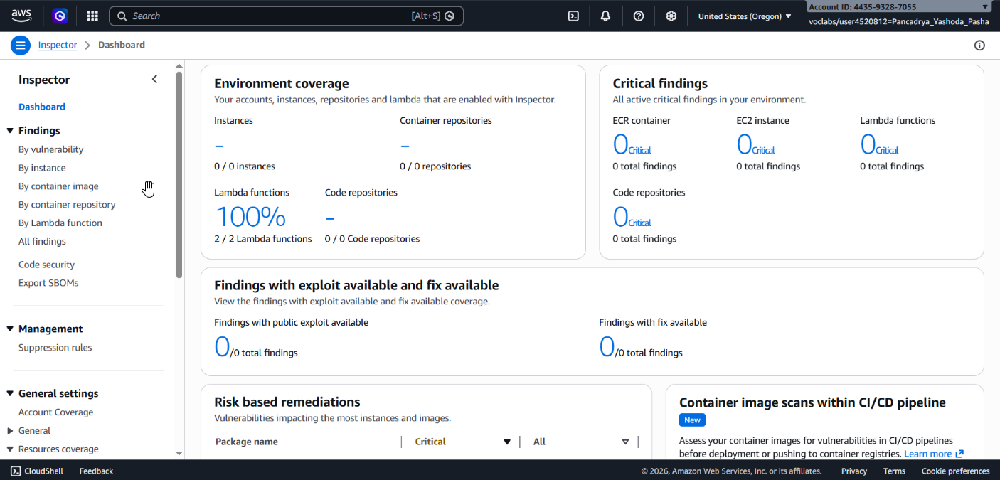
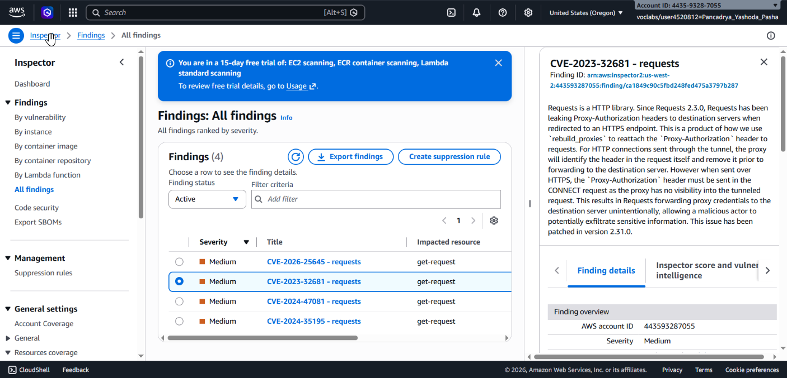
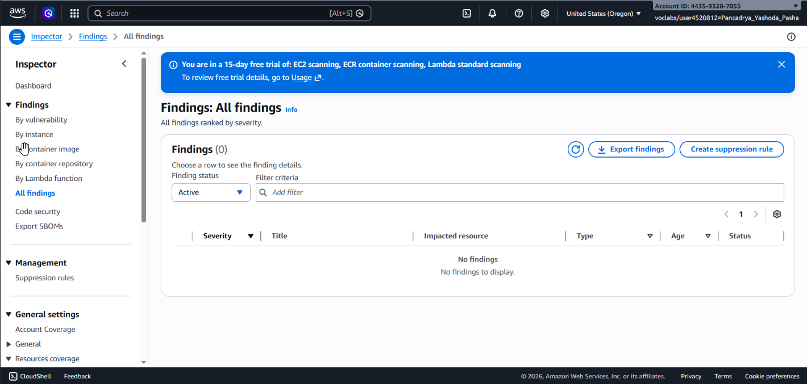

## 📌 Project Description

In modern cloud ecosystems, security must be integrated into every phase of the development lifecycle. This project demonstrates the implementation of **Continuous Security Monitoring** and **Vulnerability Management** for serverless architectures using Amazon Inspector.

The primary objective of this experiment is to automate the scanning of software package and source code vulnerabilities running within AWS Lambda, and to execute appropriate remediation based on industry security standards (NIST/NVD).

## 🛠️ Tech Stack & AWS Services

- **AWS Security Services:** Amazon Inspector
- **Compute Services:** AWS Lambda, Amazon EC2
- **Languages & Packages:** Python (`requests` library)
- **Concepts:** DevSecOps, Vulnerability Assessment, CVE (Common Vulnerabilities and Exposures), Serverless Architecture.

---

## 🏢 Business Scenario

A company (AnyCompany) is in the initial phases of building a serverless application utilizing AWS Lambda. As part of a broader system integration and cybersecurity posture enhancement initiative, the engineering team requires an automated security tool to scan for vulnerable software packages seamlessly during new deployments. Amazon Inspector was selected for its capability to provide instant, comprehensive scanning across AWS Lambda, Amazon EC2, and Amazon ECR.

---

## 🚀 Implementation Steps

### Phase 1: Activation & Continuous Scanning Configuration

The first step involves configuring comprehensive security visibility across the AWS environment.

- Activated **Amazon Inspector** globally within the AWS account.
- Verified the environment coverage dashboard to ensure that 100% of AWS Lambda functions, EC2 instances, and ECR repositories were actively included in the standard scanning scope.

### Phase 2: Vulnerability Analysis

Once the initial scan was completed, the next phase involved investigating the security findings.

- Reviewed the _All Findings_ dashboard and identified a **Medium** severity vulnerability within a specific Lambda function (`get-request`).
- Isolated the specific finding: **CVE-2023-32681**, which targeted an outdated Python `requests` package.
- Cross-referenced the Vulnerability ID with the _National Vulnerability Database (NVD)_ from NIST to thoroughly understand the attack vector and potential impact of the outdated package.

### Phase 3: Remediation Execution

After identifying the root cause, direct corrective action was applied to the affected resource.

- Accessed the source code of the `get-request` Lambda function via the AWS Management Console.
- Modified the `requirements.txt` file. The hardcoded vulnerable version (`requests==2.20.0`) was stripped of its version constraints to simply `requests`. This forces the Lambda environment to fetch and install the latest, most secure version of the package during initialization.
- Successfully redeployed the Lambda function.

### Phase 4: Security Verification (Post-Remediation)

The new deployment automatically triggered Amazon Inspector to initiate a fresh scan (_event-driven security_).

- Monitored the _Findings Dashboard_ and filtered the status to **Closed**.
- Verified that the **CVE-2023-32681** finding was successfully resolved and closed.
- Confirmed that the _Last Scanned_ timestamp on the Lambda function had updated, indicating the production environment was now secure and free from the identified vulnerability.

---

## 🎯 Results & Key Takeaways

- **Security Automation:** Successfully implemented hands-free vulnerability scanning that natively integrates with the Lambda deployment lifecycle.
- **Compliance Assurance:** Ensured that code dependencies adhere to the latest security standards and are free from known CVEs.
- **Rapid Incident Resolution:** Demonstrated the ability to identify security flaws and deploy code remediation (patching) within minutes, significantly minimizing the window of exposure to potential cyber threats.
