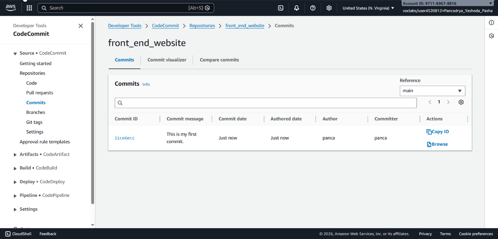
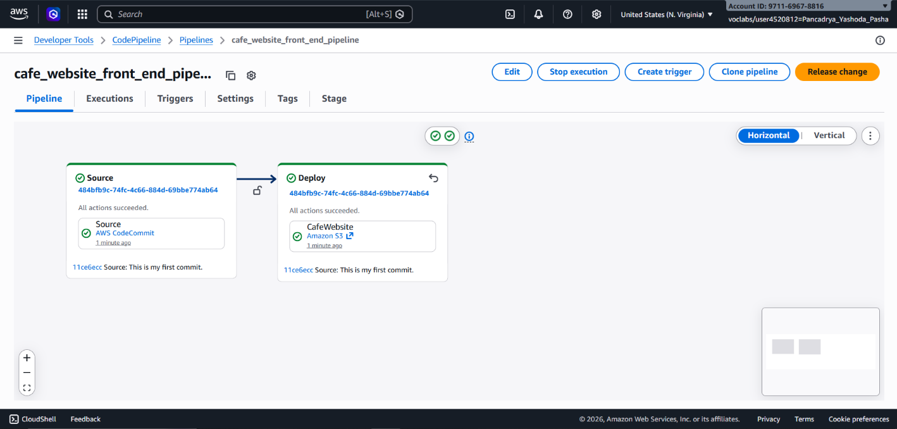

## 📌 Project Description

In the modern software development lifecycle, manually uploading files to production servers is an error-prone and inefficient practice. This project demonstrates the implementation of **DevOps** principles by building a fully automated CI/CD pipeline architecture using native AWS developer tools.

The primary objective of this project is to centralize source code into a secure repository and orchestrate an automated pipeline that seamlessly deploys code changes directly to the production environment (Amazon S3 & CloudFront) with zero downtime.

## 🛠️ Tech Stack & AWS Services

- **Developer Tools:** AWS CodeCommit (Private Git Repository), AWS CodePipeline.
- **Storage & Content Delivery:** Amazon S3 (Static Website Hosting & Artifact Store), Amazon CloudFront.
- **Local Environment:** Git, AWS CLI, Visual Studio Code (VS Code).
- **Concepts:** Continuous Integration / Continuous Delivery (CI/CD), Version Control System (VCS), Infrastructure as Code (JSON Pipeline Configuration).

---

## 🏢 Business Scenario

A mid-sized business manages a public-facing website that requires frequent content updates. Previously, the team had to manually upload HTML/JS files to Amazon S3 for every change, causing collaboration bottlenecks and a lack of code version visibility. To support team scalability and deployment reliability, a CI/CD pipeline was engineered. This solution empowers multiple developers to collaborate on a single codebase securely, ensuring that every commit pushed to the main branch is automatically deployed to production.

---

## 🚀 Implementation Steps

### Phase 1: Version Control Setup (Source)

- Provisioned a highly secure, private Git repository using **AWS CodeCommit** (`front_end_website`).
- Cloned the repository to the local development environment (VS Code) utilizing the HTTPS (GRC) protocol.
- Executed the initial commit to establish the repository's foundational directory structure.

### Phase 2: CI/CD Pipeline Configuration (Deploy)

- Provisioned the **AWS CodePipeline** architecture programmatically via the AWS CLI using a declarative JSON configuration (`cafe_website_front_end_pipeline.json`).
- **Source Stage:** Integrated the pipeline to track changes on the `main` branch of the CodeCommit repository.
- **Deploy Stage:** Configured Amazon S3 as the deployment target. Output artifacts are automatically extracted and pushed to the production bucket.
- Injected `Cache-Control` metadata (`max-age=14`) into the pipeline deployment configuration to ensure seamless integration with Amazon CloudFront edge caching.

### Phase 3: Git Integration & Local Workflow

- Established a developer workflow utilizing the VS Code Git integration.
- Migrated the local production website assets into the local repository directory.
- Staged, committed, and pushed the updated codebase to the upstream CodeCommit repository via the terminal.

### Phase 4: Automated Deployment Validation

- Monitored the AWS CodePipeline visualizer to confirm that the Git push successfully triggered an automated pipeline execution.
- Verified the live deployment by accessing the Amazon CloudFront distribution domain.
- Utilized browser developer tools to inspect HTTP headers, successfully validating the `Cache-Control: max-age=14` implementation deployed by the pipeline.

---

## 🎯 Results & Key Takeaways

- **Full Automation (Zero-Touch Deployment):** Successfully eliminated manual deployment processes. A simple `git push` command now updates the production website in seconds.
- **Centralized Collaboration (Version Control):** Enabled robust revision tracking, code auditing, and instant rollback capabilities by migrating source control to AWS CodeCommit.
- **Optimized Content Delivery:** Automated caching metadata injection within the pipeline ensures that the S3 storage and CloudFront CDN integration performs optimally without manual intervention.
