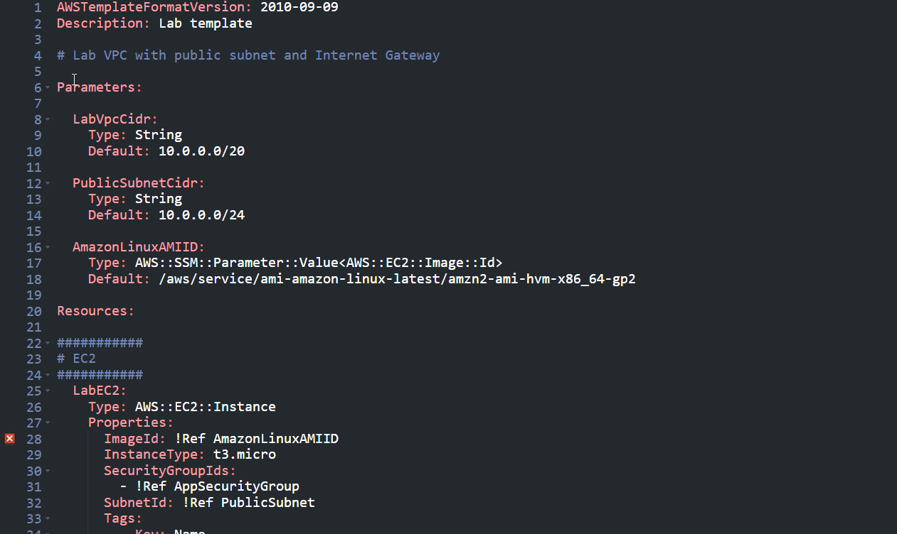

## 📌 Project Description

Manually provisioning cloud infrastructure via the AWS console is prone to human error, difficult to version track, and highly inefficient at scale. This project demonstrates the implementation of **Infrastructure as Code (IaC)** using **AWS CloudFormation** to declare, deploy, and update architectural resources in an automated, consistent, and repeatable manner.

Through this experiment, I authored and modified YAML-based CloudFormation templates to provision networking (VPC), storage (S3), and compute (EC2) environments. I also managed the complete stack lifecycle, executing infrastructure iterations (Update Stack) and resource teardowns (Delete Stack).

## 🛠️ Tech Stack & AWS Services

- **Management & Governance:** AWS CloudFormation, AWS Systems Manager (Parameter Store).
- **Networking & Security:** Amazon VPC, Subnets, Security Groups.
- **Compute & Storage:** Amazon EC2, Amazon S3.
- **Concepts:** Infrastructure as Code (IaC), YAML syntax, CloudFormation Templates (Parameters, Resources, Outputs), Stack Lifecycle Management.

---

## 🏢 Business Scenario

An organization is preparing to distribute a new application, but the IT team faces bottlenecks in deploying the underlying infrastructure. Manual provisioning often leads to configuration drift across environments (Development, Staging, Production). To standardize this process, the architecture is defined entirely as code. This code can be version-controlled (e.g., via Git), peer-reviewed by the security team, and automatically executed by AWS CloudFormation whenever fresh infrastructure is demanded.

---

## 🚀 Implementation Steps

### Phase 1: Automated Network Provisioning

- Deployed the initial CloudFormation stack utilizing a foundational `task1.yaml` template.
- **Parameters:** Defined CIDR blocks for the VPC and subnets to ensure the template remained dynamic and reusable.
- **Resources:** Automated the creation of an Amazon VPC, Public Subnet, Route Table, and baseline Security Group.
- Monitored the Events and Resources tabs within the CloudFormation console to trace the deployment orchestration (`CREATE_IN_PROGRESS` to `CREATE_COMPLETE`).

### Phase 2: Infrastructure Iteration - Adding Amazon S3

- Modified the YAML template locally to introduce a storage layer.
- Consulted the _AWS CloudFormation Resource Specification_ documentation to correctly configure an `AWS::S3::Bucket` resource snippet.
- Uploaded the revised template (`task2.yaml`) and executed the **Update Stack** operation.
- Validated the CloudFormation Change Set, ensuring that the update operation solely added the new S3 bucket without disrupting or replacing the running VPC services.

### Phase 3: Advanced Compute Integration - Adding Amazon EC2

- Elevated template complexity by introducing compute resources with inter-resource dependencies.
- Implemented the **AWS Systems Manager (SSM) Parameter Store** resolution (`AWS::SSM::Parameter::Value<AWS::EC2::Image::Id>`) within the Parameters block to dynamically fetch the latest Amazon Linux 2 Amazon Machine Image (AMI) ID, ensuring the template is future-proof against AMI version deprecation.
- Defined an Amazon EC2 instance (`AWS::EC2::Instance`) utilizing a `t3.micro` instance type.
- Leveraged the intrinsic function **`!Ref`** to cross-reference the EC2 instance deployment to resources previously defined within the same template, specifically linking the `AppSecurityGroup` and `PublicSubnet`.
- Applied a consistent tagging strategy (`Key: Name, Value: App Server`).
- Deployed the final template (`task3.yaml`) and validated the instance availability within the EC2 console.

### Phase 4: Centralized Teardown (Stack Termination)

- Demonstrated complete lifecycle management by executing the **Delete Stack** command.
- Verified that CloudFormation systematically and cleanly terminated all associated components (EC2, S3, Security Group, VPC) generated by the stack, thereby preventing cloud waste and ghost billing.

---

## 🎯 Results & Key Takeaways

- **Environment Standardization:** Successfully translated cloud architecture into declarative YAML configurations, ensuring that complex infrastructures can be replicated identically on demand.
- **Safe Change Management:** Demonstrated secure infrastructure iteration via CloudFormation Change Sets, mitigating the risks associated with manual modifications on live systems.
- **Dynamic Provisioning:** Showcased the ability to engineer intelligent, production-grade templates by utilizing SSM Parameter integration for automated AMI ID resolution, reducing long-term template maintenance.
