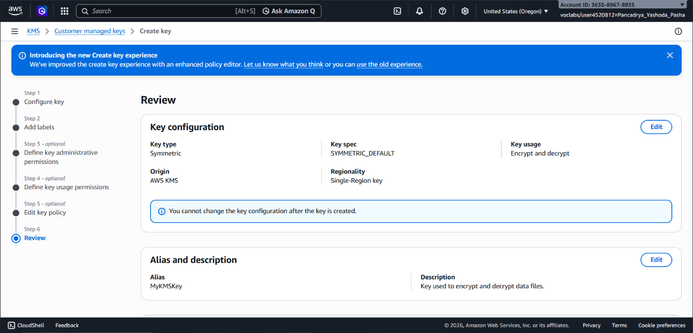
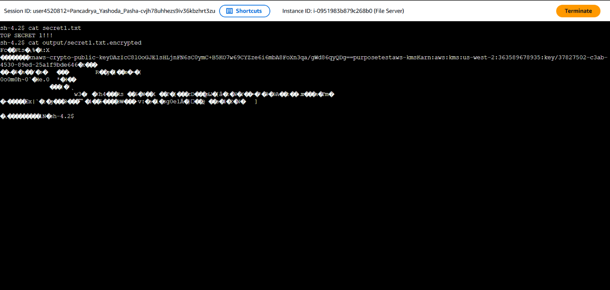

## 📌 Project Description

Data security is paramount in cloud architecture. This project demonstrates best practices for protecting sensitive information (_Data-at-Rest_) using centralized cryptographic techniques. Through this experiment, I implemented file encryption and decryption processes directly on a server using **AWS Key Management Service (KMS)** and the **AWS Encryption CLI**.

The primary objective of this project is to ensure data confidentiality. In the event of a file system breach, the stored data remains as unreadable _ciphertext_ without the explicit authorization keys required to decrypt it.

## 🛠️ Tech Stack & AWS Services

- **Security & Cryptography:** AWS Key Management Service (KMS), AWS Encryption SDK / CLI.
- **Compute & Management:** Amazon EC2, AWS Systems Manager (Session Manager), AWS IAM.
- **Concepts:** Symmetric Encryption, Ciphertext vs Plaintext, Least Privilege Access, Data-at-Rest Protection.

---

## 🏢 Business Scenario

An organization stores sensitive data within a File Server running on Amazon EC2. To meet rigorous industry security compliance standards (such as FIPS 140-2), security administrators are required to ensure that all text files containing confidential data are never stored in _plaintext_. The implemented solution involves generating a centrally managed symmetric encryption key and leveraging command-line tools to encrypt files locally on the server. This ensures that only entities with the exact IAM permissions can decrypt and access the data.

---

## 🚀 Implementation Steps

### Phase 1: Cryptographic Key Generation (AWS KMS)

- Provisioned a **Symmetric Encryption Key** within AWS KMS, utilizing the same key for both encryption and decryption to maximize speed and operational efficiency.
- Configured the key alias (`MyKMSKey`) and strictly attached administrative and usage permissions to a specific IAM Role, strictly adhering to the principle of _least privilege_.

### Phase 2: File Server Configuration & AWS Encryption CLI

- Accessed the Amazon EC2 instance (_File Server_) securely without relying on external SSH keys or a bastion host, utilizing **AWS Systems Manager (Session Manager)** instead.
- Configured AWS CLI credentials locally within the server environment to establish secure communication with the AWS KMS service.
- Installed the Python-based **AWS Encryption CLI** (`aws-encryption-sdk-cli`) to enable direct cryptographic operations from the terminal.

### Phase 3: Encryption Operations (Plaintext to Ciphertext)

- Created a _plaintext_ document containing mock sensitive data.
- Executed the encryption command (`aws-encryption-cli --encrypt`) referencing the _Amazon Resource Name_ (ARN) of the provisioned KMS Key.
- Applied the `--commitment-policy require-encrypt-require-decrypt` parameter to enforce enhanced security measures during the cryptographic operation.
- Validated the output: The original file was successfully transformed into _ciphertext_ (`secret1.txt.encrypted`), rendering it completely unreadable to unauthorized users.

### Phase 4: Decryption Operations (Ciphertext to Plaintext)

- Demonstrated the data recovery process by executing the `--decrypt` command against the encrypted ciphertext file.
- The system securely verified the IAM permissions against AWS KMS before authorizing the decryption process.
- Successfully restored the file back to its readable _plaintext_ format, proving both data integrity and availability.

---

## 🎯 Results & Key Takeaways

- **Assured Data Security:** Successfully converted sensitive data into an impenetrable _ciphertext_ format, neutralizing the threat of data exploitation by unauthorized actors.
- **Centralized Key Management:** Demonstrated proficiency in managing cryptographic lifecycles using AWS KMS, backed by FIPS 140-2 validated hardware security modules.
- **DevSecOps Proficiency:** Showcased the ability to operate advanced cryptographic toolsets (AWS Encryption SDK) seamlessly within a Linux command-line environment.
