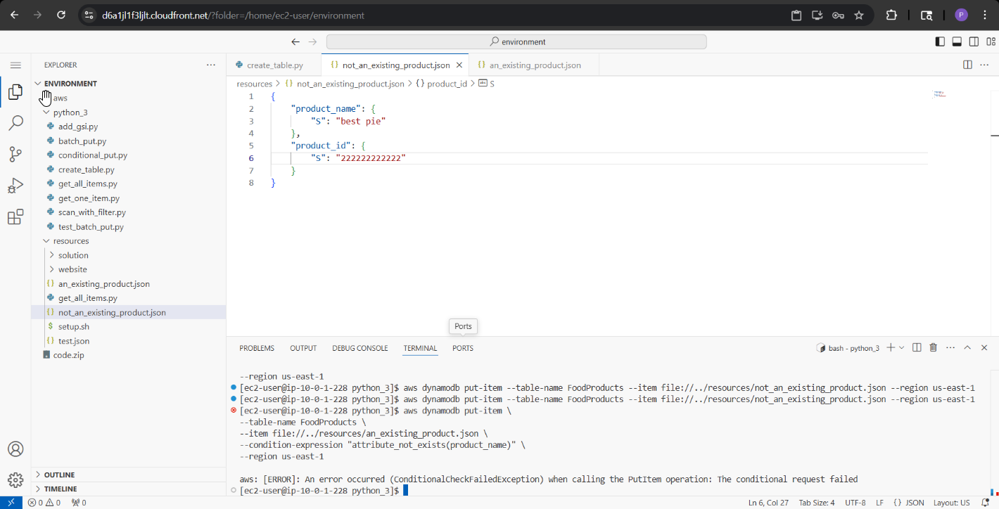
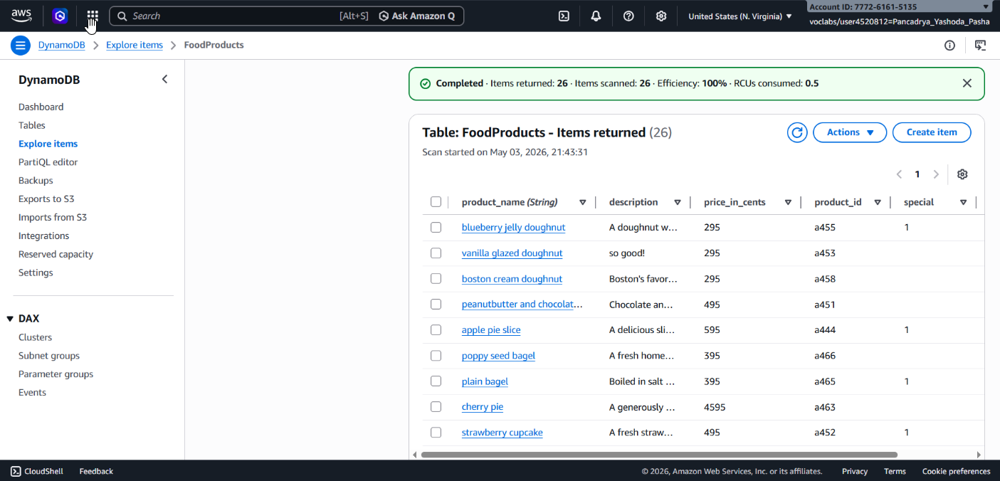
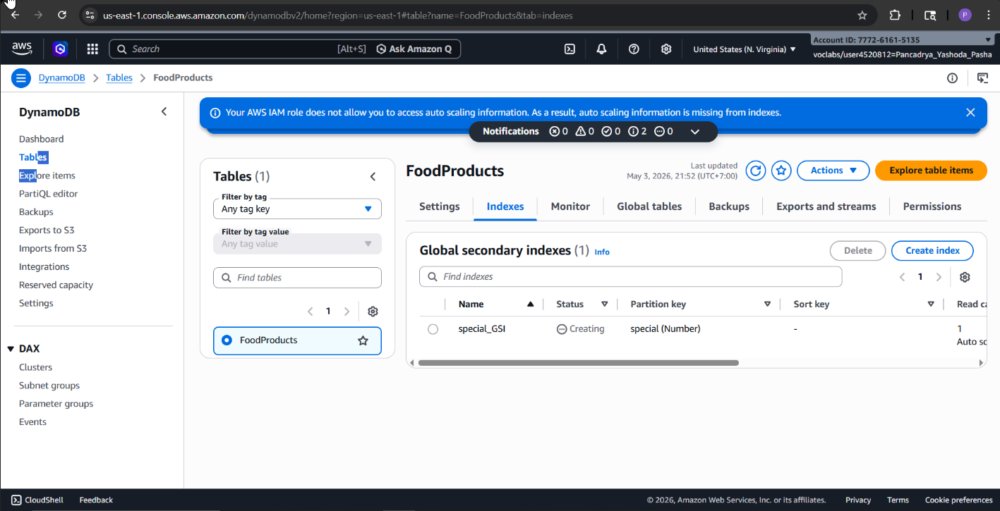

## 📌 Project Description

In modern application development, serverless NoSQL databases are highly sought after due to their ability to scale infinitely and automatically. This project demonstrates the design, manipulation, and optimization of **Amazon DynamoDB** using the **AWS SDK for Python (Boto3)** and the **AWS CLI**.

Throughout this project, I migrated static data (hard-coded JSON) from a website into a dynamic database. The core focus of this experiment was validating data integrity during single insert operations (conditional puts), processing hundreds of records simultaneously (batch writing), and optimizing read performance using a Sparse Index via the creation of a **Global Secondary Index (GSI)**.

## 🛠️ Tech Stack & AWS Services

- **Database:** Amazon DynamoDB (NoSQL).
- **Development & Scripting:** Python 3, AWS SDK for Python (Boto3), AWS CLI.
- **Development Environment:** AWS Cloud9 (Cloud IDE).
- **Concepts:** NoSQL Data Modeling, Primary Keys (Hash Key), Conditional Expressions, Batch Processing, Global Secondary Indexes (GSI), Sparse Indexes, Data Pagination.

---

## 🏢 Business Scenario

A café website currently loads its menu statically via a JSON file stored on Amazon S3. As menu variations increase and prices change dynamically, this approach is no longer sustainable. As a _Cloud Developer_, I was tasked with building a database backend using Amazon DynamoDB. Business requirements mandated that the system reject duplicate data, process bulk uploads of new menus without overwriting existing data, and efficiently search for promotional items (_on offer_) without scanning the entire database table.

---

## 🚀 Implementation Steps

### Phase 1: Table Creation & Data Modeling (Boto3)

- Executed a Python script to provision the DynamoDB table (`FoodProducts`).
- Designated `product_name` as the _Primary Key (Hash Key)_ with a String (`S`) data type. Because DynamoDB is schemaless, only the primary key required definition during table creation.

### Phase 2: Single Data Manipulation (Put-Item & Conditional Expressions)

- Utilized the AWS CLI (`aws dynamodb put-item`) to insert the initial data payload into the table.
- Enforced data protection mechanisms by appending the `ConditionExpression='attribute_not_exists(product_name)'` parameter using Boto3. This rule prevents the `put_item` command from accidentally overwriting data if the product name already exists, returning a `ConditionalCheckFailedException` error when duplication is detected.

### Phase 3: Bulk Data Processing (Batch Write)

- Automated the ingestion of multiple products into the database using the `batch_writer()` method.
- Analyzed data duplication scenarios: By default, this method utilizes a _last write wins_ logic (overwriting legacy data). To align with business standards, this feature was disabled.
- Implemented a _fail-fast_ approach: The script was engineered to fail immediately and return a `ValidationException` warning if duplicates existed in the load queue, ensuring data integrity remained pristine from the start.
- Successfully ingested dozens of product records post-JSON data cleansing.

### Phase 4: Query Optimization & Global Secondary Index (GSI)

- Authored a `scan()` function to retrieve all data rows, implementing programmatic pagination (processing data via a `LastEvaluatedKey` while loop) to elegantly handle DynamoDB's 1MB size limit.
- **Optimization:** To prevent costly full-table scans (_RCU/Read Capacity Units_ waste) when querying for promotional menus, I provisioned a **Global Secondary Index (GSI)** named `special_GSI` utilizing `special` as the Hash Key.
- Implemented a **Sparse Index**: Utilized a targeted `scan()` method against the newly created GSI, coupled with a `FilterExpression=Not(Attr('tags').contains('out of stock'))`. This allowed the application to exclusively surface "special" menus that are "in stock", vastly minimizing database latency and operational costs.

---

## 🎯 Results & Key Takeaways

- **Data Integrity Assurance:** Proved competency in preventing data anomalies (accidental duplication/overwrites) by integrating _Conditional Expressions_ within Boto3 architectural scripts.
- **NoSQL Cost Optimization:** Showcased an advanced understanding of DynamoDB billing mechanics by implementing GSIs and Sparse Indexes, preventing expensive full-table scans when querying a fraction of the dataset (special menus).
- **AWS SDK (Boto3) Expertise:** Demonstrated proficiency in engineering Python-based administrative tools to manipulate table schemas, orchestrate data pagination (_while loops_), and handle high-volume batch processing scenarios.
