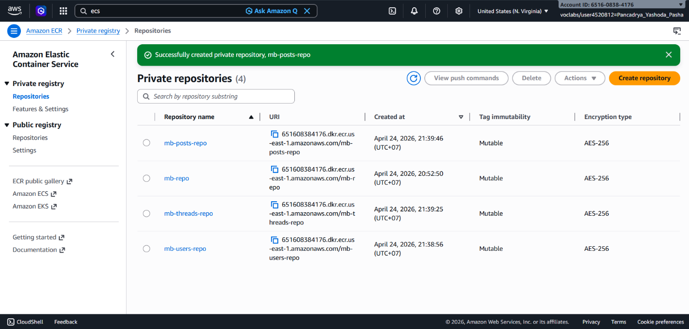
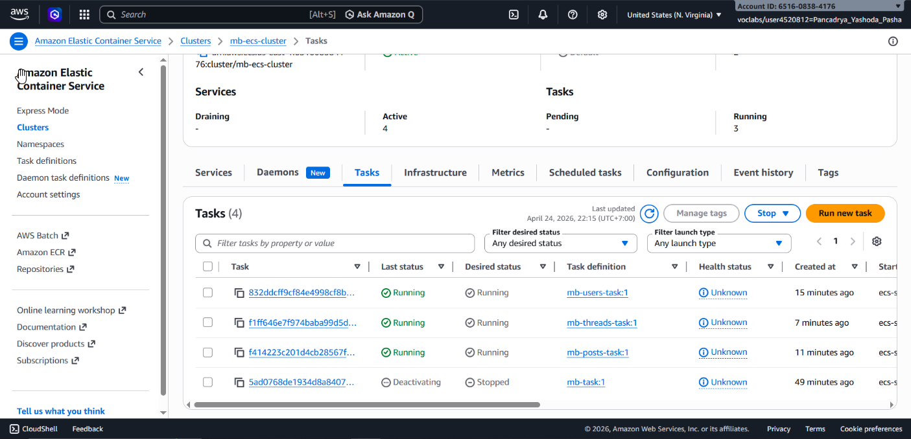
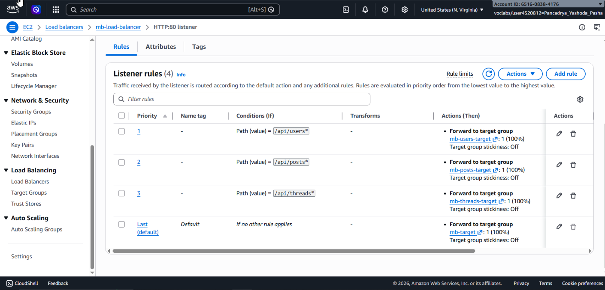

## 📌 Project Description

Traditional monolithic architectures are notoriously difficult to scale and maintain as the codebase grows. This project demonstrates a comprehensive **Application Modernization** journey, beginning with the containerization of a monolithic Node.js application, followed by its complete refactoring into a **Microservices** architecture orchestrated by an **Amazon Elastic Container Service (ECS)** cluster.

Through this project, I successfully decoupled a message board application into independent business domain services (Users, Threads, Posts), built distinct Docker images, pushed them to private repositories, and orchestrated them using an **Application Load Balancer (ALB)** with Path-Based Routing rules to precisely direct API traffic.

## 🛠️ Tech Stack & AWS Services

- **Container Orchestration:** Amazon Elastic Container Service (ECS), AWS Fargate/EC2 Launch Types.
- **Container Registry & Tooling:** Amazon Elastic Container Registry (ECR), Docker CLI.
- **Compute & Networking:** Amazon EC2, Application Load Balancer (ALB).
- **Development Environment:** AWS Cloud9 (Cloud IDE), Node.js, Koa Framework.
- **Concepts:** Application Modernization, Monolith to Microservices Refactoring, Dockerization, Path-Based Routing.

---

## 🏢 Business Scenario

A message board application running directly on a Node.js server faced severe scalability bottlenecks. If the "Posts" module experienced a traffic spike, the entire monolithic application had to be scaled uniformly, resulting in massive compute resource waste. As a _Cloud/DevOps Engineer_, I was tasked with refactoring the application code, encapsulating each business capability into isolated Docker containers, and deploying this microservices architecture atop an Amazon ECS orchestration cluster. This ensures each service can be scaled and updated independently without causing system-wide downtime.

---

## 🚀 Implementation Steps

### Phase 1: Dockerization (Containerizing the Monolith)

- Prepared the Node.js application by stripping out internal Node.js clustering features to convert it into a single-process architecture optimized for containerization.
- Authored an `alpine-node` based `Dockerfile` to immutably package the source code and dependencies.
- Authenticated the Docker CLI, built the image, tagged it, and pushed it to a private **Amazon Elastic Container Registry (ECR)** repository.

### Phase 2: Refactoring to Microservices

- Audited the codebase architecture and logically split the RESTful API routing code into three independent microservices entities: `Users`, `Threads`, and `Posts`.
- Replicated the Phase 1 procedures to provision separate ECR repositories (`mb-users-repo`, `mb-threads-repo`, `mb-posts-repo`), built the distinct Docker images for each service, and uploaded them.

### Phase 3: Amazon ECS Cluster & Task Definition Setup

- Provisioned an **Amazon ECS** compute cluster (`mb-ecs-cluster`) backed by Amazon EC2 instances.
- Delegated resources by creating isolated **Task Definitions** for each microservice (`mb-users-task`, `mb-posts-task`, `mb-threads-task`), explicitly allocating 0.5 vCPU, 1GB of Memory, and configuring container port mappings (`3000`).

### Phase 4: Service Deployment & Path-Based Routing (ALB)

- Deployed each Task Definition as an independent, continuously running **ECS Service** within the cluster.
- Interfaced every ECS Service behind a single, centralized **Application Load Balancer (ALB)**.
- Engineered ALB _Listener Rules_ to enforce Layer-7 Path-Based Routing:
  - Requests matching `/api/users*` were forwarded to `mb-users-target`.
  - Requests matching `/api/posts*` were forwarded to `mb-posts-target`.
  - Requests matching `/api/threads*` were forwarded to `mb-threads-target`.

  

- Decommissioned the legacy monolithic service (setting _Desired Tasks_ to `0`) to completely cut over all workloads to the newly decoupled microservices architecture.

---

## 🎯 Results & Key Takeaways

- **Microservices Decoupling:** Successfully dismantled a rigid monolith into independent API services. If the `Posts` module suffers an outage, the `Users` and `Threads` services remain fully operational without disruption (Fault Isolation).
- **Scalability & Cost Efficiency:** Leveraging Amazon ECS and ALB, each microservice now possesses its own independent auto-scaling profile, preventing the massive compute waste associated with scaling an entire monolithic stack.
- **Advanced Traffic Management:** Proved advanced competency in managing Layer-7 application routing by utilizing an Application Load Balancer to logically distribute traffic to distinct container target groups, all operating seamlessly behind a single domain entry point.
