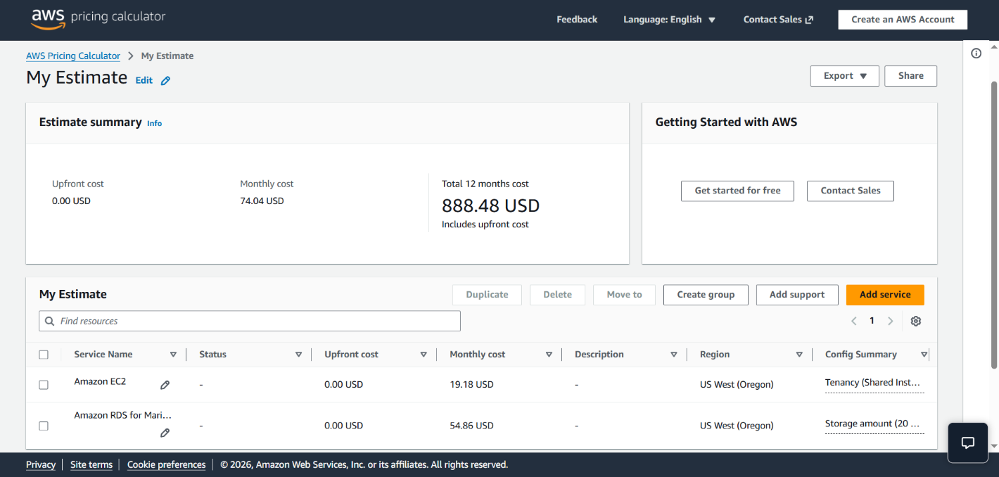
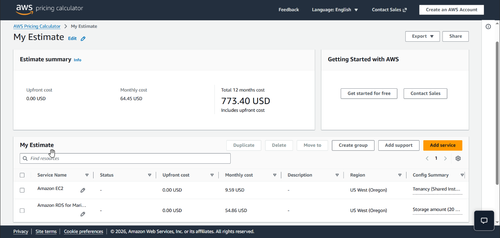

## 📌 Project Description

The true power of cloud computing lies not just in its ability to scale up, but also in its elasticity to scale down for cost efficiency. This project demonstrates practical **FinOps (Cloud Financial Operations)** principles through rigorous resource rightsizing.

Throughout this project, I optimized a web server environment post-database migration. I uninstalled deprecated local database engines, downgraded the compute specifications programmatically using the **AWS CLI**, and validated the Total Cost of Ownership (TCO) savings using the **AWS Pricing Calculator**.

## 🛠️ Tech Stack & AWS Services

- **Compute & Storage:** Amazon EC2, Amazon EBS.
- **Cost Management:** AWS Pricing Calculator.
- **Tools & Operations:** AWS CLI, Secure Shell (SSH), Linux Package Management (`yum`, `systemctl`).
- **Concepts:** FinOps, Rightsizing, Total Cost of Ownership (TCO), Infrastructure Optimization.

---

## 🏢 Business Scenario

A web application recently completed its database migration to a managed service (Amazon RDS). However, the application's web server (Amazon EC2) was still running on its legacy, oversized compute specifications, and the local database engine (MariaDB) was still running idly, wasting compute resources. As a _Cloud Engineer_, I was tasked with cleaning up this legacy workload, rightsizing the instance specifications to be more cost-effective, and projecting the company's monthly cloud savings.

---

## 🚀 Implementation Steps

### Phase 1: Legacy Workload Cleanup

- Established a secure SSH connection to the active Amazon EC2 web server.
- Halted and completely uninstalled the local database packages using `sudo systemctl stop mariadb` and `sudo yum -y remove mariadb-server`.
- This action immediately freed up idle CPU and memory resources.

### Phase 2: CLI-Driven Infrastructure Rightsizing

- Utilized the **AWS CLI** from an isolated management host to execute infrastructure operations programmatically, bypassing the AWS Management Console.
- Queried the AWS API to extract the exact `InstanceId` based on the server's name tag.
- Safely halted the instance using the `aws ec2 stop-instances` command.
- Executed the rightsizing operation by issuing the `aws ec2 modify-instance-attribute` command, successfully downgrading the instance type to a lower specification tier.
- Restarted the instance and validated the new configuration state and dynamic Public IP using the `aws ec2 describe-instances` command.

### Phase 3: TCO Analysis & FinOps Projection

- Leveraged the **AWS Pricing Calculator** to model the financial architecture both previous and post-optimization.
- **Pre-Optimization:** Running the legacy EC2 compute instance ($19.18) with its attached EBS volume ($54.86) yielded a total estimated cost of **$74.04/month**.

  

- **Post-Optimization:** Running the rightsized EC2 compute instance ($9.59) alongside the same EBS volume ($54.86) reduced the total cost to **$64.45/month**.

  

- **Results:** Slashed the EC2 compute costs by exactly 50%, successfully projecting a continuous **$9.59** monthly cost reduction (~13% overall savings on this specific server).

---

## 🎯 Results & Key Takeaways

- **FinOps Culture Implementation:** Demonstrated strong financial awareness, proving that effective cloud engineering is not solely about performance, but also about maximizing cost efficiency (cost-aware engineering).
- **AWS CLI Automation:** Showcased operational proficiency in managing resource lifecycles and modifying infrastructure attributes programmatically using the Command Line Interface.
- **Data-Driven Rightsizing:** Successfully purged deprecated software (MariaDB) to justify the EC2 compute downgrade, demonstrating a deep understanding of responsive cloud capacity management.
