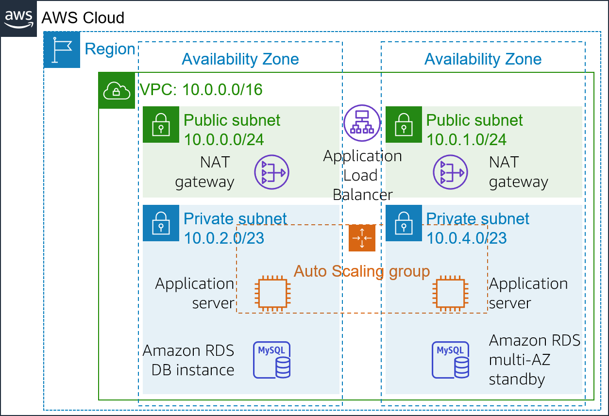

## 📌 Project Description

Mission-critical business systems must remain operational even in the face of underlying component or data center failures. This project demonstrates the transformation of a vulnerable, monolithic application into a **Highly Available (HA)** and **Fault-Tolerant** Three-Tier Architecture by distributing workloads across multiple Availability Zones (AZs).

I successfully implemented Load Balancing, Auto Scaling, Database Redundancy (Multi-AZ), and Network High Availability (Redundant NAT Gateways) to ensure the application achieves near-zero downtime and self-healing capabilities during disruptions.

## 🛠️ Tech Stack & AWS Services

- **Compute & Scaling:** Amazon EC2, Amazon Machine Image (AMI), EC2 Auto Scaling Groups (ASG), Launch Templates.
- **Networking & Content Delivery:** Amazon VPC, Application Load Balancer (ALB), NAT Gateways, Internet Gateways, Route Tables.
- **Database:** Amazon RDS (Multi-AZ Deployment).
- **Security:** Interlocking Security Groups (Three-Tier Security).
- **Concepts:** High Availability (HA), Fault Tolerance, Chaos Testing, Self-Healing Infrastructure, Three-Tier Architecture.

---

## 🏢 Business Scenario

A critical inventory application was originally running on a single server, creating a Single Point of Failure (SPOF). If the server or its host Availability Zone experienced an outage, the application would face complete downtime. The enterprise required an architectural redesign so the application could:

- Distribute incoming web traffic automatically.
- Recover failed servers autonomously (self-healing).
- Protect data against a single database instance failure.
- Decouple the web, application, and database tiers using security best practices (Defense in Depth).

---

## 🚀 Implementation Steps

### Phase 1: Load Balancing & Three-Tier Security

- Provisioned an **Application Load Balancer (ALB)** within Public Subnets across two Availability Zones to evenly distribute HTTP traffic.
- Configured Target Groups with aggressive Health Checks (10-second intervals) to rapidly identify and isolate unhealthy servers.
- Secured inter-tier traffic flows utilizing tightly scoped **Security Groups**:
  - _ALB Security Group:_ Permitted HTTP/HTTPS inbound from the internet.
  - _Application Security Group:_ Strictly permitted traffic only from the ALB.
  - _Database Security Group:_ Strictly permitted traffic only from the Application Servers (blocking all direct public or ALB access).

### Phase 2: Compute Auto Scaling (Self-Healing Configuration)

- Generated a custom **Amazon Machine Image (AMI)** (Golden Image) from an active web server pre-configured with the required application stack (_Apache, PHP, AWS SDK_).
- Authored a **Launch Template** defining compute specifications, IAM Roles, Security Groups, and User Data bootstrapping scripts for new instances.
- Deployed an **Auto Scaling Group (ASG)** spanning two Private Subnets, capping the minimum and maximum capacity at 2 instances. This ASG was seamlessly integrated with the ALB to ensure newly spawned instances immediately serve traffic.

### Phase 3: Database High Availability & Scaling (Advanced)

- Reconfigured the Amazon RDS (MySQL) instance to operate in a **Multi-AZ Deployment**.
- AWS now synchronously replicates data from the Primary Instance to a Standby Instance in a secondary AZ. In the event of a primary failure, the DNS endpoint automatically fails over to the Standby with no required application code changes.
- Executed vertical scaling on the RDS instance to a `db.t3.small` class with 10GB of allocated storage, applying the modifications immediately.

### Phase 4: Network Redundancy (Redundant NAT Gateways) (Advanced)

- Identified a networking SPOF where Private Subnet 2 was dependent on the NAT Gateway located in the first AZ.
- Provisioned a **secondary NAT Gateway** attached to a new Elastic IP within Public Subnet 2.
- Modified the Route Table for Private Subnet 2 to route outbound internet traffic (0.0.0.0/0) through its local NAT Gateway. This guarantees that an outage in one AZ will not sever internet outbound access for servers in the surviving AZ.

### Phase 5: Chaos Testing & Resilience Validation

- Simulated catastrophic infrastructure failure by forcefully terminating an active web server instance via the EC2 console.
- Validated that the ALB immediately drained traffic from the dead instance and routed all users to the healthy instance, resulting in zero end-user disruption.
- Observed AWS Auto Scaling detect the capacity deficit and autonomously launch a replacement instance (_self-healing_) to restore the cluster to its Desired State (2 instances).

---

## 🎯 Results & Key Takeaways

- **Fault-Tolerant Architecture:** Successfully eradicated all Single Points of Failure across the networking (NAT), compute (EC2), and database (RDS) layers.
- **Defense in Depth Security:** Application servers and databases were confined to Private Subnets, completely shielded from the public internet and accessible only via an authenticated intermediary layer (ALB).
- **Automated Disaster Recovery:** The infrastructure is now capable of autonomously detecting instance failures and executing self-healing procedures, ensuring strict Service Level Agreements (SLAs) for application availability are met.
