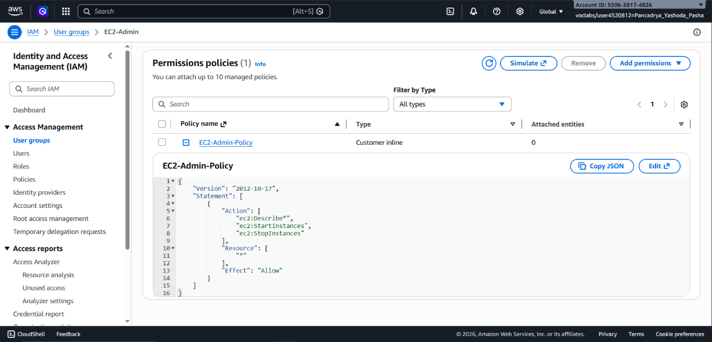
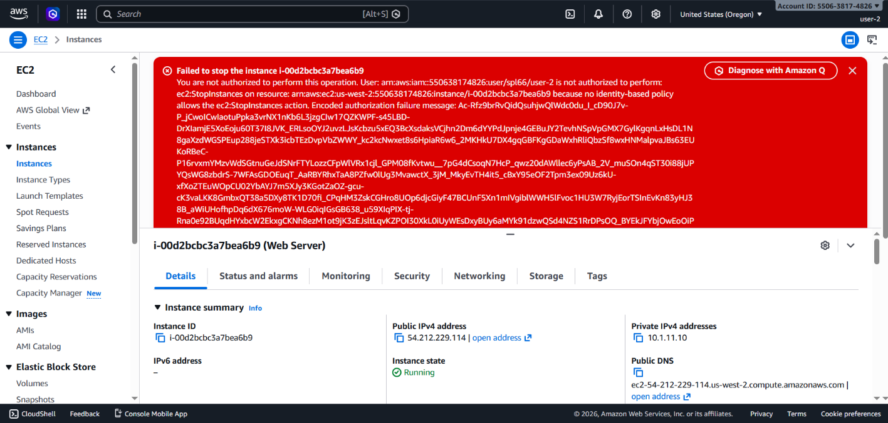

## 📌 Project Description

Cloud infrastructure security begins with robust identity management. This project demonstrates the implementation of **AWS Identity and Access Management (IAM)** to architect a security posture based on the principles of _Least Privilege_ and _Role-Based Access Control_ (RBAC).

Through this project, I engineered account-level security guardrails (password policies), configured user groups with highly specific permissions (utilizing both _Managed_ and _Inline Policies_), and conducted authorization testing to ensure strict _Separation of Duties_ (SoD) within a production-like environment.

## 🛠️ Tech Stack & AWS Services

- **Security, Identity, & Compliance:** AWS Identity and Access Management (IAM).
- **Target Services:** Amazon EC2, Amazon S3.
- **Concepts:** Role-Based Access Control (RBAC), Least Privilege, Separation of Duties (SoD), AWS Managed Policies vs Customer Inline Policies, Password Hardening.

---

## 🏢 Business Scenario

A rapidly growing tech enterprise is aggressively scaling its utilization of Amazon EC2 and Amazon S3. As the IT staff expands, utilizing highly-privileged (root/admin) credentials across the board poses a catastrophic security risk. The enterprise requires a centralized authorization framework where staff are granted access exclusively to the resources required for their specific job functions:

- **S3 Support Staff:** Restricted to viewing S3 buckets and objects only.
- **EC2 Support Staff:** Restricted to monitoring EC2 dashboards with explicit denial of server state modification rights.
- **EC2 Administrators:** Granted full lifecycle management rights (start/stop) over EC2 instances.

---

## 🚀 Implementation Steps

### Phase 1: Account Security Hardening (Password Policy)

- Enforced a custom account-level password policy to mandate security compliance.
- Configured strict parameters: Minimum 10 characters, requiring a combination of uppercase, lowercase, numeric, and non-alphanumeric characters.
- Implemented credential rotation lifecycle (90-day expiration) and prevented the reuse of the last 5 passwords.

### Phase 2: RBAC Architecture Design (User Groups & Policies)

- Audited and analyzed logical user groups: `S3-Support`, `EC2-Support`, and `EC2-Admin`.
- Applied **AWS Managed Policies** (`AmazonS3ReadOnlyAccess` and `AmazonEC2ReadOnlyAccess`) for the Support tiers, ensuring automatic policy updates mapped by AWS.
- Engineered a highly granular **Customer Inline Policy** (`EC2-Admin-Policy`) specifically for the Administrator group to strictly govern `ec2:Describe*`, `ec2:StartInstances`, and `ec2:StopInstances` API actions.

### Phase 3: Identity Mapping (User Assignment)

- Allocated IAM identities (`user-1`, `user-2`, `user-3`) into their respective groups based on operational roles.
- Avoided attaching policies directly to IAM users (user-level), adhering to best practices by governing permissions at the group level for enterprise scalability.

### Phase 4: Access Validation & Penetration Testing

- Conducted logical testing (authenticating as individual users via the custom IAM sign-in URL) to validate the integrity of the security posture.
- **user-1 Validation (S3 Support):** Successfully accessed S3 buckets but received an _Access Denied_ API response when attempting to access the EC2 console.
- **user-2 Validation (EC2 Support):** Successfully visualized EC2 metrics and instance lists, but API calls were explicitly blocked when attempting to execute a `Stop Instance` action.
- **user-3 Validation (EC2 Admin):** Successfully executed infrastructure intervention by legally invoking the Stop state on an EC2 instance.

---

## 🎯 Results & Key Takeaways

- **Least Privilege Enforcement:** Successfully mitigated internal/external exploitation vectors by strictly confining access scopes to exact job requirements.
- **Access Management Scalability:** Championed the use of User Groups (RBAC) over individual permissions, enabling the organization to onboard/offboard staff securely and efficiently at scale.
- **Enterprise Compliance:** Hardened password policies ensured the AWS account adheres to standard security control frameworks (e.g., SOC2, ISO 27001).
