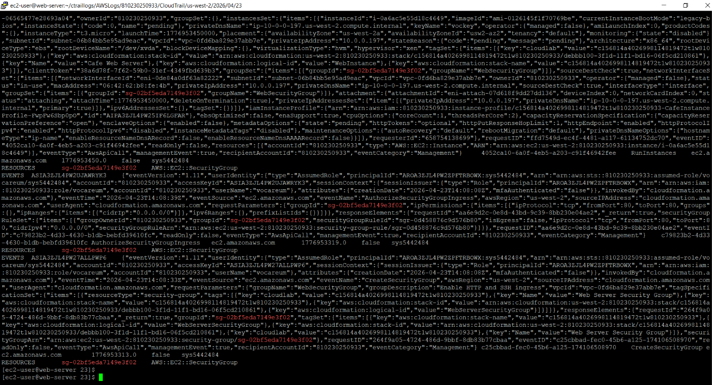
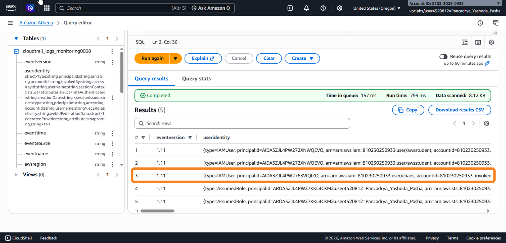
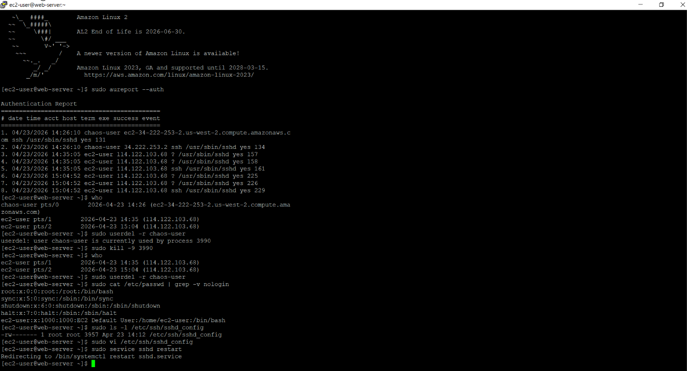

## 📌 Project Overview

This project demonstrates an end-to-end cloud incident response and forensic investigation workflow within an AWS environment. The investigation involved identifying the source of a website defacement incident, tracing unauthorized infrastructure changes through audit logs, and performing remediation at both the operating system and cloud infrastructure levels.

The workflow combined AWS CloudTrail auditing, Amazon Athena log analysis, and Linux-based forensic techniques to investigate suspicious API activity, identify compromised identities, and restore the affected environment.

---

## 🛠️ Tech Stack & AWS Services

- **Compute & Access:** Amazon EC2 (Target Instance & Forensics Workstation), AWS IAM (Identity & Access Management).
- **Storage & Analytics:** Amazon S3 (Log Repository), Amazon Athena (Serverless SQL Querying).
- **Security & Auditing:** AWS CloudTrail (Audit Log Analysis), VPC Security Groups (Hardening).
- **Tools & Concepts:** Incident Response, Linux Forensics (`grep`, `gunzip`, `who`, `kill`, `vi`), SSH Security Configuration.

---

## 🏢 Scenario

An e-commerce web application was defaced with unauthorized content. During the investigation, the infrastructure team also identified that the EC2 Security Group had been modified to allow unrestricted SSH access (`0.0.0.0/0`) from the internet.

The objective of the investigation was to:

- Identify the actor responsible for the infrastructure modification
- Analyze AWS API activity associated with the incident
- Investigate unauthorized access to the EC2 instance
- Remove malicious access and harden the environment against further compromise

---

## 🚀 Implementation

### Phase 1: Incident Detection & Initial Triage

- Identified unauthorized modifications on the web application frontend.
- Investigated EC2 Security Group configurations and discovered an overly permissive inbound SSH rule.
- Enabled and verified AWS CloudTrail logging to capture account activity and API events.
- Configured CloudTrail logs to be stored securely in Amazon S3 for analysis.

---

### Phase 2: CloudTrail Log Investigation using Linux CLI

- Established a secure SSH session to the affected EC2 instance.
- Downloaded compressed CloudTrail log files from Amazon S3 using:
  ```bash
  aws s3 cp
  ```
- Extracted and analyzed JSON log data using Linux utilities including:
  ```bash
  gunzip
  grep
  cat
  ```
- Filtered events based on:
  - `sourceIPAddress`
  - `eventName`
  - Security Group modification activity
- Queried CloudTrail events directly using:
  ```bash
  aws cloudtrail lookup-events
  ```
  to identify Security Group-related API actions.



---

### Phase 3: Large-Scale Log Analysis using Amazon Athena

- Created an external table in Amazon Athena to query CloudTrail logs stored in Amazon S3.
- Used SQL queries to analyze infrastructure modification events and identify suspicious activity.

Example query:

```sql
SELECT DISTINCT useridentity.userName, eventName, eventSource
FROM cloudtrail_logs_monitoring####
WHERE eventname LIKE '%Security%'
ORDER BY eventtime DESC;
```

- Identified:
  - The IAM identity associated with the Security Group modification
  - The source IP address used during the API call
  - The timestamp of the unauthorized infrastructure change
- Correlated findings with the `AuthorizeSecurityGroupIngress` API event.



---

### Phase 4: System Remediation & Security Hardening

#### OS-Level Investigation & Remediation

- Investigated active SSH sessions using:
  ```bash
  who
  ```
- Reviewed authentication activity using:
  ```bash
  aureport --auth
  ```
- Terminated suspicious sessions and processes using:
  ```bash
  kill -9
  ```
- Removed unauthorized local user accounts from the EC2 instance.

---

#### SSH Hardening

- Modified the SSH daemon configuration:
  ```bash
  /etc/ssh/sshd_config
  ```
- Disabled password-based SSH authentication.
- Enforced key-based authentication for administrative access.
- Restarted the SSH service to apply the updated configuration.

---

#### Infrastructure-Level Remediation

- Removed the overly permissive Security Group rule allowing public SSH access.
- Deleted the compromised IAM identity associated with the incident.
- Restored the original web application assets from backup files.



---

## 🎯 Key Takeaways

- Performed end-to-end cloud incident response using AWS-native auditing and analytics services.
- Gained hands-on experience analyzing CloudTrail logs using both Linux command-line utilities and Amazon Athena.
- Demonstrated practical understanding of AWS IAM activity auditing and Security Group investigation workflows.
- Applied Linux-based forensic techniques to identify and terminate unauthorized access on an EC2 instance.
- Strengthened the environment through layered remediation, including:
  - IAM cleanup
  - Security Group hardening
  - SSH configuration hardening
  - Restoration of application integrity
