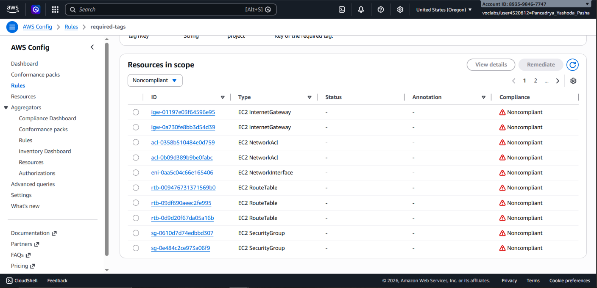

## 📌 Project Description

The ability to monitor applications and infrastructure in real-time is the cornerstone of reliable IT service delivery. This project demonstrates the implementation of a comprehensive **Observability** and **Governance** ecosystem on AWS.

Throughout this project, I automated the mass installation of monitoring agents, extracted OS-level metrics (memory and disk space), monitored application logs to detect anomalies (error rates), orchestrated event-driven notifications, and enforced continuous automated infrastructure compliance auditing.

## 🛠️ Tech Stack & AWS Services

- **Management & Governance:** Amazon CloudWatch (Logs, Metrics, Alarms, Events/EventBridge), AWS Systems Manager (Run Command, Parameter Store), AWS Config.
- **Application Integration:** Amazon Simple Notification Service (SNS).
- **Compute:** Amazon EC2.
- **Concepts:** Cloud Observability, Log Analytics (Metric Filters), Event-Driven Architecture, IT Compliance Auditing, FinOps (Resource Optimization).

---

## 🏢 Business Scenario

An e-commerce enterprise required deep visibility into their web server fleet. They were frequently unaware of broken pages (404 Not Found errors) that negatively impacted user experience. Additionally, the IT Audit team mandated that all cloud resources strictly adhere to corporate tagging standards, and that no orphaned storage volumes (EBS) were left incurring idle operational costs.

---

## 🚀 Implementation Steps

### Phase 1: Automated Agent Provisioning (AWS Systems Manager)

- Eliminated manual installation toil by leveraging **SSM Run Command** to deploy the `AmazonCloudWatchAgent` across target instances remotely.
- Centralized the CloudWatch Agent JSON configuration file within the **SSM Parameter Store** (`Monitor-Web-Server`). This configuration instructed the agent to ship web server logs (Access & Error) and internal system metrics (CPU iowait, memory utilization, disk space) that are natively invisible to standard EC2 metrics.

### Phase 2: Log Analytics & Automated Alerting (CloudWatch Logs)

- Accessed the web server and simulated application anomalies by requesting non-existent pages to generate `404 Not Found` logs.
- Engineered a **Metric Filter** in CloudWatch Logs utilizing the pattern syntax `[ip, id, user, timestamp, request, status_code=404, size]` to dynamically extract 404 errors from raw text logs into a quantifiable metric.
- Configured a **CloudWatch Alarm** to trigger an **Amazon SNS** notification (via Email) if the 404 error rate exceeded a defined threshold (e.g., > 5 errors within 1 minute).

### Phase 3: Event-Driven Monitoring (CloudWatch Events/EventBridge)

- Architected an event-driven response workflow using CloudWatch Events to monitor EC2 instance state changes in real-time.
- Defined logical rules to detect `stopped` or `terminated` EC2 states and automatically routed these events to an SNS topic, providing instant administrative alerts regarding unexpected server shutdowns.

### Phase 4: Automated Compliance Auditing (AWS Config)

- Activated **AWS Config** to continuously record infrastructure configurations and evaluate them against internal corporate policies.
- Deployed two managed compliance rules:
  - `required-tags`: Audited all resources to enforce the presence of a `project` tag (critical for cost allocation and billing).
  - `ec2-volume-inuse-check`: Scanned the environment for Amazon EBS volumes not attached to any EC2 instance, preventing cloud waste and ghost billing (FinOps best practices).
- Reviewed the reporting dashboard to identify both **Compliant** and **Non-compliant** resources.

---

## 🎯 Results & Key Takeaways

- **Deep Infrastructure Visibility:** Successfully bypassed standard AWS metric limitations by leveraging the CloudWatch Agent to monitor OS-level telemetry (memory/disk) centrally.
- **Operational Intelligence:** Transformed raw log data into actionable, predictive alerts, drastically reducing the Mean Time to Discovery (MTTD) for application-level errors.
- **Continuous Governance:** Established automated guardrails using AWS Config to guarantee that the infrastructure continuously adheres to corporate tagging standards and remains cost-optimized.
