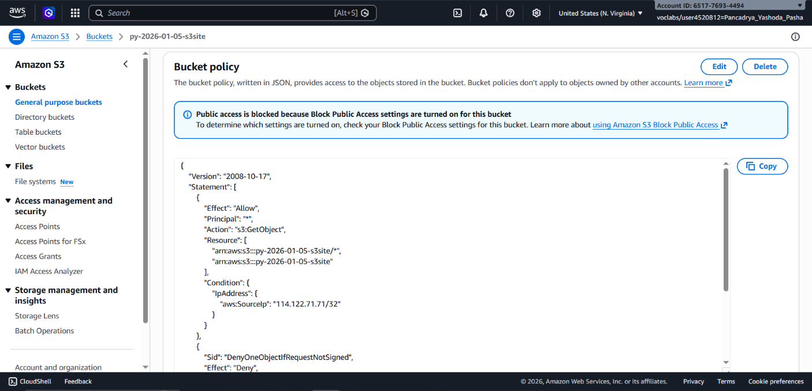
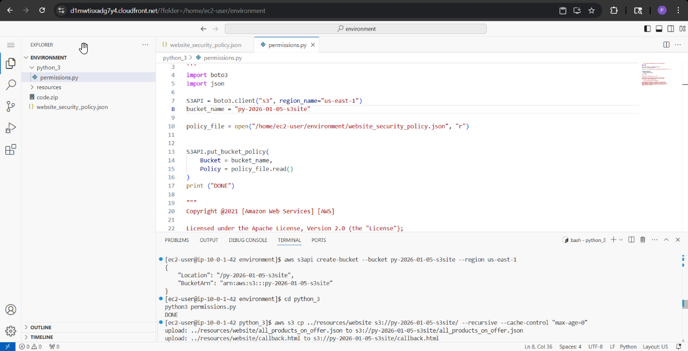
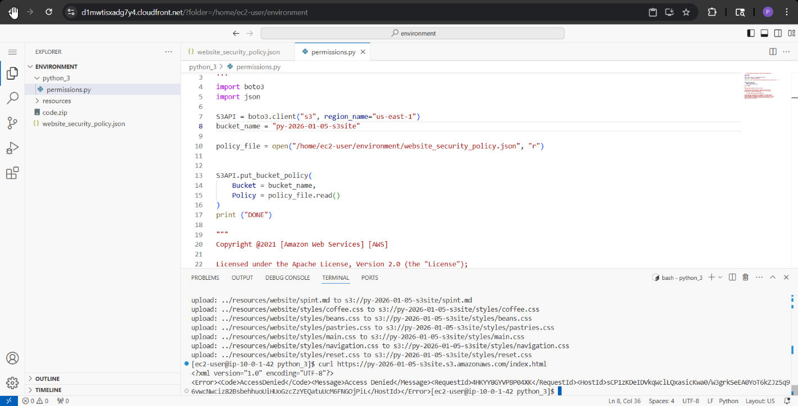

## 📌 Project Description

Hosting static websites in the cloud requires not just scalability, but rigorous access security. This project demonstrates the implementation of **Amazon S3** as an efficient and resilient static website hosting platform.

The core focus of this project is securing website assets during the development phase by enforcing network-based access controls via a custom **Bucket Policy**. Furthermore, this project highlights proficiency in automating infrastructure permission lifecycle and content deployment using programmatic scripting via **Python (AWS SDK/Boto3)** and the **AWS CLI**.

## 🛠️ Tech Stack & AWS Services

- **Storage & Hosting:** Amazon S3.
- **Security:** S3 Bucket Policies, IAM (Identity and Access Management).
- **Automation & Scripting:** Python 3, AWS SDK for Python (Boto3), AWS CLI.
- **Development Environment:** AWS Cloud9 (Cloud IDE).
- **Concepts:** Static Website Hosting, IP Allowlisting, Infrastructure Automation, JSON Policy Definition, Caching Metadata (`max-age=0`).

---

## 🏢 Business Scenario

A local café aims to establish an online presence by launching a prototype website showcasing their product catalog and store details. During this proof-of-concept phase, the site must not be exposed to the public and should only be accessible to management via the café's internal network. As a _Cloud Engineer_, I was tasked with provisioning the S3 hosting infrastructure, enforcing strict network security rules (IP Allowlisting), and scripting an automated pipeline to deploy HTML, CSS, JS, and image assets to the cloud.

---

## 🚀 Implementation Steps

### Phase 1: Storage Provisioning (AWS CLI)

- Prepared the development environment utilizing the **AWS Cloud9 IDE**, ensuring the AWS SDK (Boto3) and AWS CLI v2 were properly configured.
- Declaratively provisioned the object storage repository via the AWS CLI (`aws s3api create-bucket`), applying a unique naming convention (`[initials]-YYYY-MM-DD-s3site`).
- Disabled the _Block Public Access_ feature at the S3 level via the console to permit granular, policy-based read permissions in subsequent steps.

### Phase 2: Security & Access Control (Python & Boto3)

- Authored a JSON-based **S3 Bucket Policy** enforcing the principle of _Least Privilege_. The policy explicitly allowed (`Allow`) the `s3:GetObject` action exclusively for a specific public IPv4 address (IP Allowlisting) using the conditional block `"aws:SourceIp": "<ip-address>/32"`.
- Embedded a secondary statement block (`Deny`) to block access to a specific file (`report.html`) unless requested via a cryptographically signed _Presigned URL_.
- Executed a custom **Python (Boto3)** script to seamlessly inject and apply the JSON security policy to the target bucket.

### Phase 3: Automated Artifact Deployment (AWS CLI)

- Performed a bulk deployment of the static web artifacts into S3.
- Leveraged the AWS CLI (`aws s3 cp ... --recursive`) to recursively upload the entire source tree (HTML, JS, CSS, and graphics) to the bucket.
- Simultaneously injected custom HTTP Header metadata (`--cache-control "max-age=0"`) onto every object. This prevented browser caching, ensuring clients always retrieved the latest iteration of files during active development.

### Phase 4: Network & Security Validation

- Validated website availability by accessing the Amazon S3 **Object URL** in a browser connected to the whitelisted local network (successfully loading the DOM and JS assets).
- Conducted external network Penetration Testing: Dispatched a `GET` request using the `curl` utility directly from the isolated Cloud9 terminal.
- Proved the security perimeter functioned as designed, as Amazon S3 immediately rejected the request with an `AccessDenied` error for originating outside the whitelisted IP address.

---

## 🎯 Results & Key Takeaways

- **Precision Access Control:** Successfully shielded development assets from web crawlers and unauthorized public access through a _Zero-Trust_ architecture utilizing IP Allowlisting conditions in the Bucket Policy.
- **Infrastructure Automation Proficiency:** Demonstrated agility in operating headlessly (without GUI) by utilizing **Boto3 (Python)** and the AWS CLI for provisioning, security policy management, and programmatic content deployment.
- **Data Management:** Showcase the ability to manipulate object-level metadata tags (Cache-Control) at upload time to facilitate rapid-cycle development workflows.
