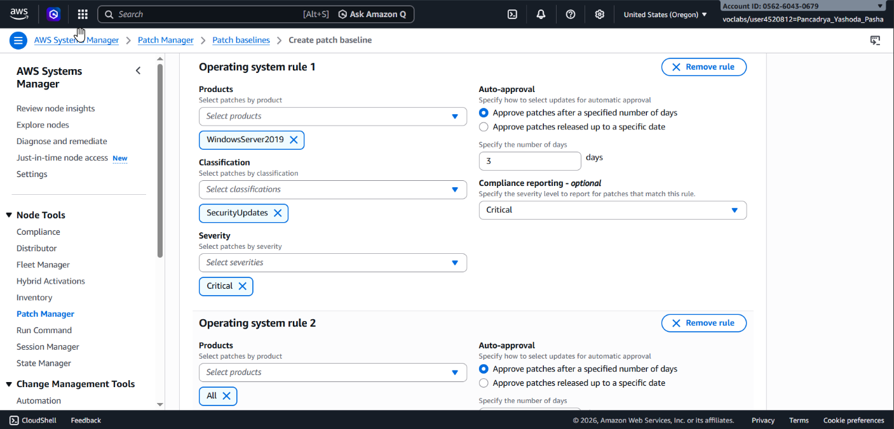
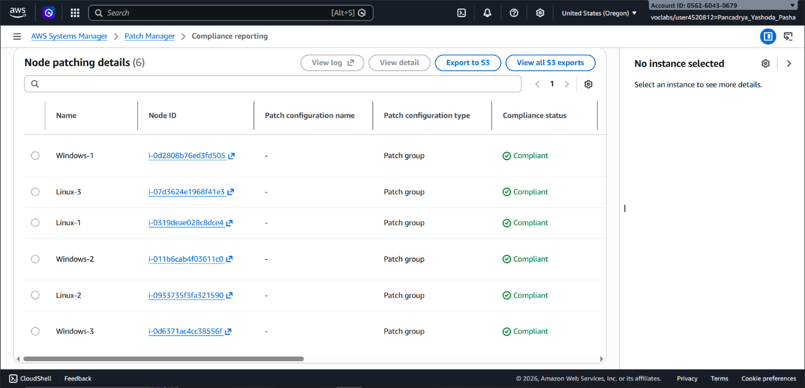

## 📌 Project Description

In enterprise environments with hundreds or thousands of servers, keeping operating systems (OS) up to date is a significant logistical challenge. This project demonstrates how to automate OS updates, enforce security policies, and maintain compliance centrally across a multi-OS fleet (Linux and Windows) using AWS Systems Manager Patch Manager.

## 🛠️ Tech Stack & AWS Services

- **Management & Governance:** AWS Systems Manager (SSM), Patch Manager, State Manager, Fleet Manager.
- **Compute Services:** Amazon EC2.
- **Operating Systems:** Amazon Linux 2, Windows Server 2019.
- **Concepts:** Systems Hardening, Fleet Management, Infrastructure as Code (Tags/Patch Groups), Compliance Reporting.

---

## 🏢 Business Scenario

An organization operates a mixed fleet of Linux and Windows instances. To prevent security exploits and ensure system stability, IT administrators require an automated mechanism to scan and install software updates without manual intervention. This solution must apply distinct update baselines for different operating systems while providing a centralized compliance reporting dashboard.

---

## 🚀 Implementation Steps

### Phase 1: Patching the Linux Fleet with Default Baselines

- Utilized **Fleet Manager** to verify that Amazon EC2 instances were properly communicating with the SSM Agent and had the correct IAM roles attached.
- Executed a _Patch Now_ operation utilizing the AWS-managed default baseline (`AWS-AmazonLinux2DefaultPatchBaseline`).
- Leveraged **Patch Groups** via instance tagging (`Patch Group: LinuxProd`) to precisely target updates without affecting out-of-scope servers.

### Phase 2: Creating a Custom Patch Baseline for Windows

- Unlike the Linux environment, the Windows environment required stricter control over which updates were authorized. A Custom Patch Baseline (`WindowsServerSecurityUpdates`) was engineered for this purpose.
- Configured auto-approval rules with a 3-day delay for **Critical** and **Important** severity patches under the **SecurityUpdates** classification.
- Associated this custom baseline with a newly designated Patch Group: `WindowsProd`.

### Phase 3: Automated Execution & Tagging Strategy

- Implemented a robust tagging strategy on the Windows EC2 instances by assigning the key-value pair `Patch Group: WindowsProd`.
- Initiated a _Scan and Install_ operation via Patch Manager.
- Behind the scenes, Systems Manager leveraged **Run Command** (via the `RunPatchBaseline` SSM document) to automatically evaluate and install eligible patches.

### Phase 4: Compliance Verification & Reporting

- Reviewed the **Compliance Reporting** tab within the AWS Systems Manager dashboard.
- Verified that the entire fleet (3 Linux instances and 3 Windows instances) successfully registered a **Compliant** status.
- Analyzed node patching details to guarantee zero missed critical or security updates (0 _Critical/Security noncompliant count_).

---

## 🎯 Results & Key Takeaways

- **Enterprise Fleet Management:** Successfully implemented a strategy capable of managing hundreds of servers from a single control plane (AWS Systems Manager).
- **Centralized Compliance:** Provided real-time visibility into the security posture of the entire server fleet.
- **Operational Efficiency:** Drastically reduced the manual labor hours required for routine patching through intelligent Patch Group segmentation and auto-approval workflows.
