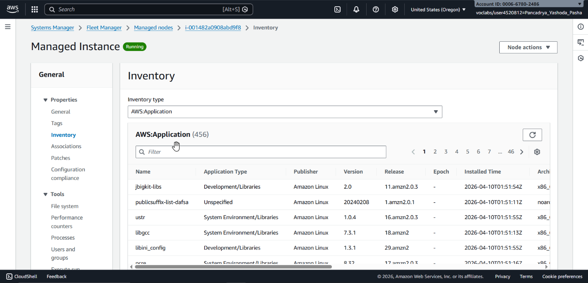
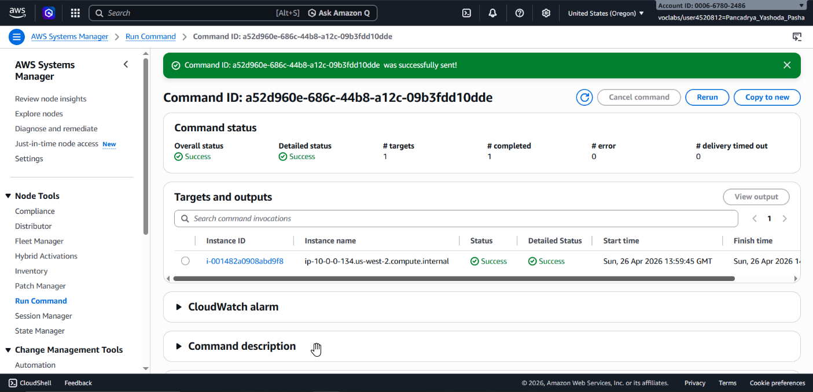
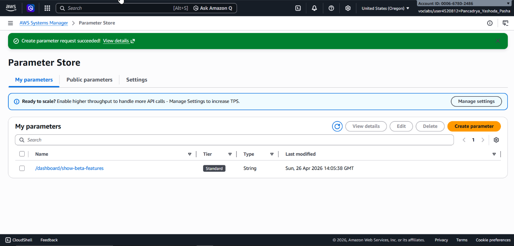
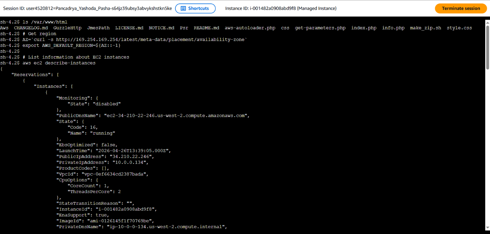

## 📌 Project Description

In large-scale cloud operations, manually managing compute instances (servers) one by one via SSH is not only inefficient but also introduces high security risks due to the necessity of opening inbound ports. This project demonstrates the implementation of **AWS Systems Manager (SSM)** to centralize IT operations, automate tasks across server fleets, and securely access servers without the need for SSH keys or bastion hosts.

Throughout this project, I implemented automated software inventory collection, deployed a custom web application without logging into the server, managed application feature flags via a parameter repository, and performed secure troubleshooting through an auditable, browser-based session.

## 🛠️ Tech Stack & AWS Services

- **Management & Governance:** AWS Systems Manager (Fleet Manager, Run Command, Parameter Store, Session Manager).
- **Compute:** Amazon EC2.
- **Concepts:** Feature Toggling (Dark Launch), Serverless Shell Access (No SSH/Bastion), Automated Software Inventory, Secure Fleet Management.

---

## 🏢 Business Scenario

A manufacturing enterprise operates a fleet of secure Amazon EC2 instances with closed inbound SSH ports to comply with strict security policies. The IT operations team required a solution to:

- Audit the software installed across the entire fleet (Inventory).
- Mass-deploy a factory dashboard application without logging into servers individually.
- Toggle application features in real-time without executing code redeployments.
- Provide secure, auditable (CloudTrail integrated) command-line access for engineering troubleshooting.

---

## 🚀 Implementation Steps

### Phase 1: Centralized Inventory Collection (Fleet Manager)

- Configured **Fleet Manager** to execute a scheduled inventory association (`Inventory-Association`) across managed instances.
- Validated the ingestion of instance metadata, enabling the IT team to audit operating system configurations and installed software packages remotely without direct connections.

### Phase 2: Automated Software Deployment (Run Command)

- Executed a custom document via **SSM Run Command** to programmatically deploy a full web application stack.
- The command automatically installed an Apache web server, PHP, the AWS SDK, and bootstrapped the _Widget Manufacturing Dashboard_ application onto the target instance.
- Validated the successful deployment by accessing the instance's public IP address via a web browser.

### Phase 3: Configuration Management & Feature Toggling (Parameter Store)

- Leveraged the **SSM Parameter Store** to securely manage application configuration settings using a hierarchical plain-text structure.
- Provisioned the parameter `/dashboard/show-beta-features` and set its value to `True`.
- Validated that the web dashboard dynamically read this parameter (acting as a feature flag) to expose hidden Beta features (_Dark Launching_) instantly, without requiring server restarts or code redeployments.

### Phase 4: Secure Remote Shell Access (Session Manager)

- Established an interactive shell terminal within the EC2 instance directly through the web browser using **SSM Session Manager**, completely bypassing standard SSH protocols (TCP Port 22 remained securely closed).
- Verified installation directories (`/var/www/html`) and executed AWS CLI commands natively within the instance (e.g., `aws ec2 describe-instances`) to validate instance-level IAM permissions.

---

## 🎯 Results & Key Takeaways

- **Zero-Trust Administration:** Proved that full server administration and troubleshooting can be conducted without opening inbound ports (like Port 22/SSH), effectively neutralizing network brute-force attack vectors.
- **Scalable Fleet Management:** Demonstrated competency in executing scripts (Run Command) and defining inventory policies across a fleet of servers simultaneously, drastically reducing manual operational toil.
- **Dynamic Feature Toggling:** Streamlined the application feature release lifecycle by mutating configuration states within Parameter Store as an advanced DevOps pattern for rolling feature releases.
