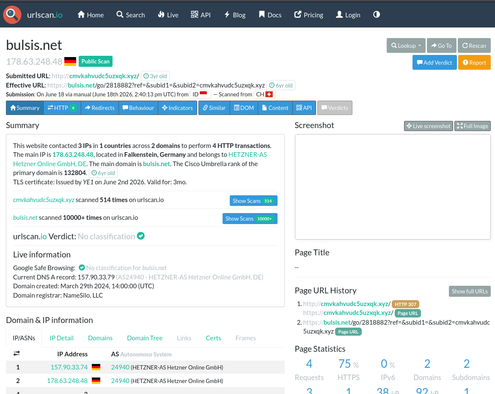
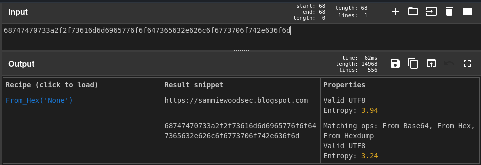
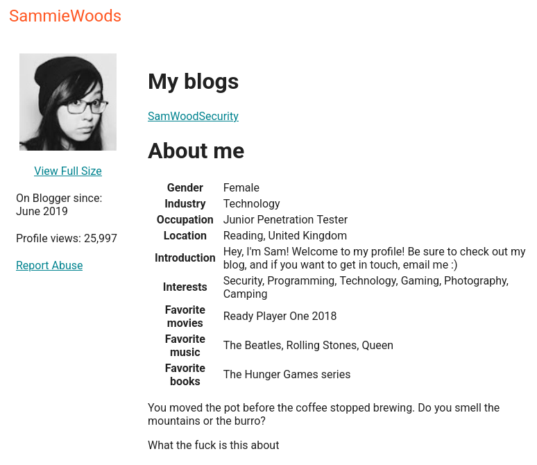

## 📌 Project Description

In cybersecurity and law enforcement, Open Source Intelligence (OSINT) is a critical methodology used to deanonymize threat actors and map their digital footprints. This project demonstrates an end-to-end OSINT investigation starting from a single alias to building a comprehensive intelligence dossier on a person-of-interest (POI).

The objective was to track an individual associated with a hacking group that recently compromised a Managed Service Provider (MSP) and attempted to sell stolen credentials. By pivoting through social media, blogs, and encoded data, I successfully uncovered the attacker's real identity, location, and employment details.

## 🛠️ Tools & Methodology

- **Tools:** urlscan.io, CyberChef, Google Dorking, Isolated Virtual Machine (VM).
- **Concepts:** Operational Security (OpSec), Link Analysis, Hexadecimal Decoding, Cross-Referencing, Identity Deanonymization.

---

## 🏢 Business Scenario

Working alongside a law enforcement organization, I was assigned to track a POI known by the Twitter/X handle `@sp1ritfyre`. While another team handled the dark web leads regarding the stolen MSP credentials, my task was to utilize clear-net OSINT sources to build a profile on the individual. The goal was to connect the alias to a real-world identity and locate any evidence linking them to the breach.

---

## 🚀 Investigation Phases

### Phase 1: Initial Pivot & Sandboxed Link Analysis

- **Alias Reconnaissance:** The investigation began with the provided Twitter handle `@sp1ritfyre`. The account itself had minimal activity, but a URL in the bio section warranted further inspection.
- **OpSec & Sandboxing:** Adhering to strict Operational Security (OpSec), I refused to click the unknown link directly. I first scanned it using **urlscan.io**, which revealed the site contacted 3 IPs across 2 domains. To verify the payload, I accessed the link from within a heavily isolated and monitored **Virtual Machine (VM)**.
- **Dead-End Discovery:** The sandboxed visit revealed that the site hosted irrelevant, spammy content (tarot readings and gambling pages). Recognizing this as a dead-end or a decoy, I pivoted my investigation strategy back to search engine queries.

### Phase 2: Cross-Referencing & Cryptographic Decoding

- **Google Dorking:** I conducted advanced searches for the alias `"Sp1ritFyre"`. This surfaced two critical leads: a Blogger.com profile and a standalone domain, `redhunt.net`.
- **Visual Correlation:** Both websites utilized the exact same profile picture as the Twitter account. Furthermore, the footer of `redhunt.net` explicitly contained the name "Sp1ritFyre", confirming asset ownership.
- **Data Extraction & Decoding:** The Blogger profile revealed an email address (`d1ved33p@gmail.com`). Interestingly, the "Location" field contained a hexadecimal string instead of a geographic location. I utilized **CyberChef** to decode the hex value, which translated to an blogspot URL: `https://sammiewoodsec.blogspot.com`.

### Phase 3: Identity Resolution & Profiling

- **Full Profile Extraction:** By exploring the newly discovered blog and clicking the profile on Blogger, I cross-referenced the email, gender hints, and professional background, successfully extracting the complete personal details of the threat actor.

---

## 🎯 Results: Threat Actor Intelligence Dossier

Through methodical OSINT pivoting, I successfully deanonymized the threat actor and compiled the following intelligence dossier for law enforcement:

- **Target Identity:** Sammie Woods
- **Age / Location:** 23 Years Old | United Kingdom
- **Employment:** Junior Penetration Tester at PhilmanSecurityInc
- **Owned Domain:** `https://redhunt.net`
- **Associated Blogs:**
  - `https://sammiewoodsec.blogspot.com`
  - `https://sp1ritfyrehackerstories.blogspot.com`
- **Associated Email:** `d1ved33p@gmail.com`
- **Key Interests:** Security, Photography, Gaming, Camping

### Key Takeaways

- **Operational Security (OpSec):** Demonstrated safe investigation practices by utilizing `urlscan.io` and isolated Virtual Machines when handling potentially malicious links.
- **Analytical Pivoting:** Showcased the ability to take a single, obscure artifact (a Twitter handle) and chain it across multiple platforms (Blogger, CyberChef) to uncover a real-world identity.
