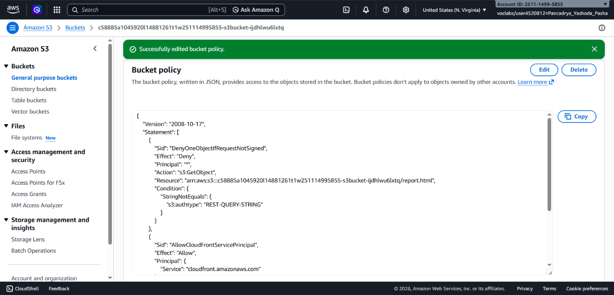
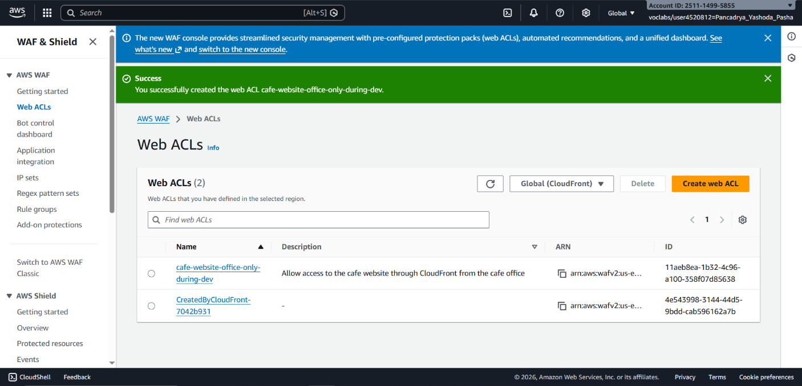
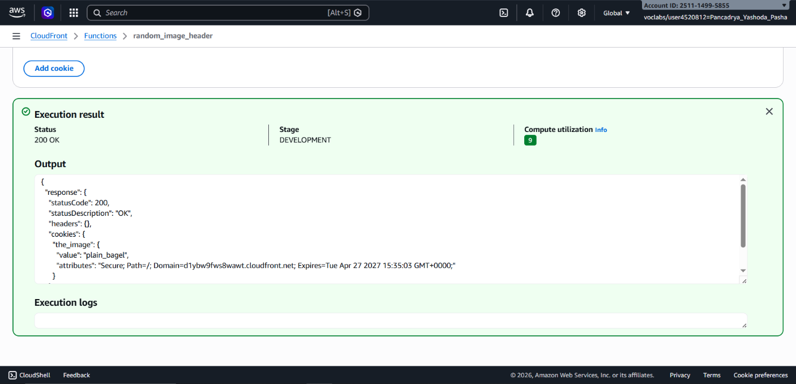
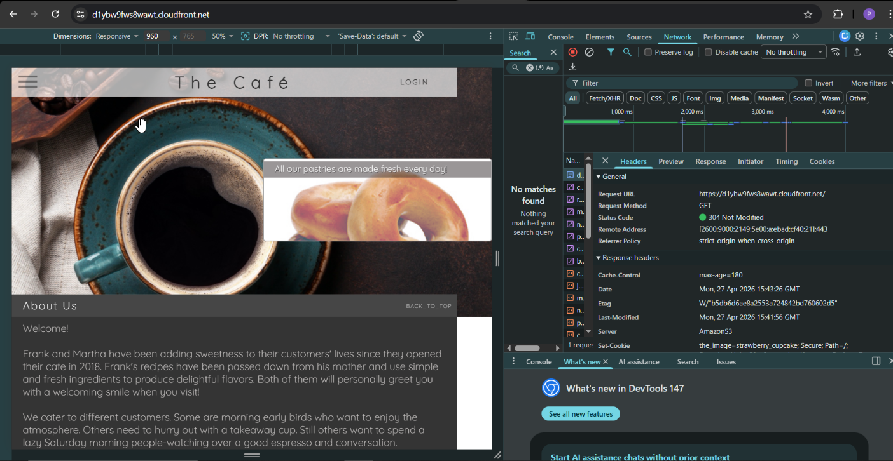

## 📌 Project Description

Performance and security are the two primary pillars of modern web applications. This project demonstrates the implementation of **Amazon CloudFront** as a global Content Delivery Network (CDN) to reduce latency and enforce HTTPS encryption, paired with **AWS WAF (Web Application Firewall)** to secure assets against unauthorized access.

Furthermore, this project highlights the use of Edge Computing via **CloudFront Functions** to execute custom logic as close to the end-user as possible, and manipulations of `Cache-Control` metadata via the AWS CLI to optimize the cache hit ratio without burdening the origin server.

## 🛠️ Tech Stack & AWS Services

- **Networking & Content Delivery:** Amazon CloudFront (CDN), CloudFront Functions (Edge Computing).
- **Security:** AWS WAF (Web ACLs, IP Sets).
- **Storage & API:** Amazon S3 (Origin), Amazon API Gateway.
- **Tools & Operations:** AWS CLI, HTTP Headers Analysis (Developer Tools).
- **Concepts:** Content Delivery, Edge Routing, IP Allowlisting, Cache Optimization (`max-age`), Zero-Trust Origin.

---

## 🏢 Business Scenario

A café website hosted on Amazon S3 experienced high latency for global users and lacked secure HTTPS connections. During the development phase, access to both the website and the backend API endpoints (API Gateway) had to be strictly limited to the corporate office network (IP Allowlisting). Additionally, the marketing team requested a dynamic image rotation feature on the homepage, but the engineering team wanted to avoid burdening the backend or bloat static files with heavy client-side scripts. The solution: Combining CDN, WAF, and Serverless Edge Computing.

---

## 🚀 Implementation Steps

### Phase 1: CDN Deployment & Zero-Trust Origin

- Configured an **Amazon CloudFront** distribution to serve the static website from an Amazon S3 bucket, enabling low-latency global content delivery over HTTPS.
- Implemented _Zero-Trust_ principles on the Origin: Modified the Amazon S3 Bucket Policy to explicitly block all direct public access. The S3 bucket now strictly serves requests routed exclusively through the CloudFront network.

### Phase 2: Application Security via AWS WAF (IP Allowlisting)

- Configured **AWS WAF** to shield the application from unsolicited network traffic during development.
- **CloudFront WAF:** Created a Global Web ACL and IP Set that whitelisted only the office's public IP address. Unrecognized external traffic (e.g., cellular networks) was automatically blocked with a `403 Forbidden` response.
- **API Gateway WAF:** Secured the backend REST API endpoints by provisioning a Regional Web ACL enforcing the exact same IP Allowlist validation, thereby protecting sensitive JSON data payloads.

### Phase 3: Edge Computing with CloudFront Functions

- Implemented lightweight compute logic at edge locations using **CloudFront Functions** (triggered on the _Viewer Response_ event).
- Authored an isolated JavaScript function that dynamically injects a randomized HTTP Cookie (`the_image`) into the user's browser. This cookie allows the frontend to dynamically rotate promotional images without requiring any backend API calls.

### Phase 4: Cache-Control Optimization via AWS CLI

- Optimized the website's caching behavior by bulk-updating the HTTP object metadata.
- Leveraged the **AWS CLI** to execute a `copy-object` operation, replacing the `Cache-Control` directive on all S3 objects to `max-age=180` (3 minutes).
- Validated the cache configuration via Browser Developer Tools, successfully verifying that CloudFront returned the `x-cache: Hit from cloudfront` header (object served directly from the edge cache) and `RefreshHit from cloudfront` (expired object revalidated with the origin).

---

## 🎯 Results & Key Takeaways

- **Global Performance & HTTPS:** Successfully mitigated application latency by globally distributing content (CDN) while enforcing strict encryption standards.
- **Precision Security Enforcement (WAF):** Demonstrated competency in shielding an S3 Origin from direct access and locking down API routes using strict IP-based Web ACL rules.
- **Edge Compute Efficiency:** Offloaded random UI processing logic from the backend and shifted it to the extreme edge of the AWS network using serverless CloudFront Functions.
