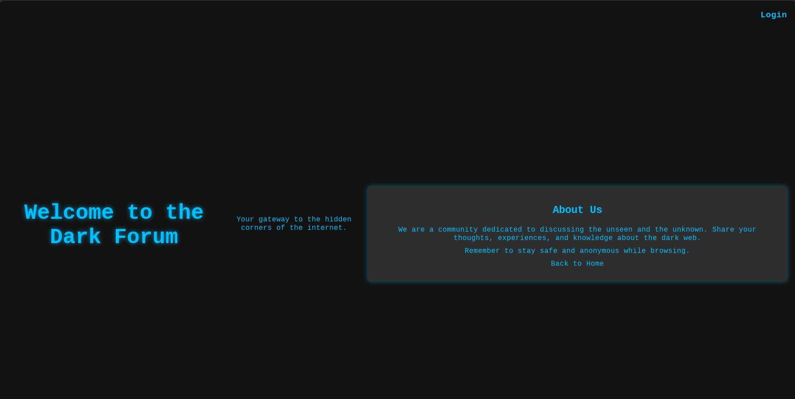
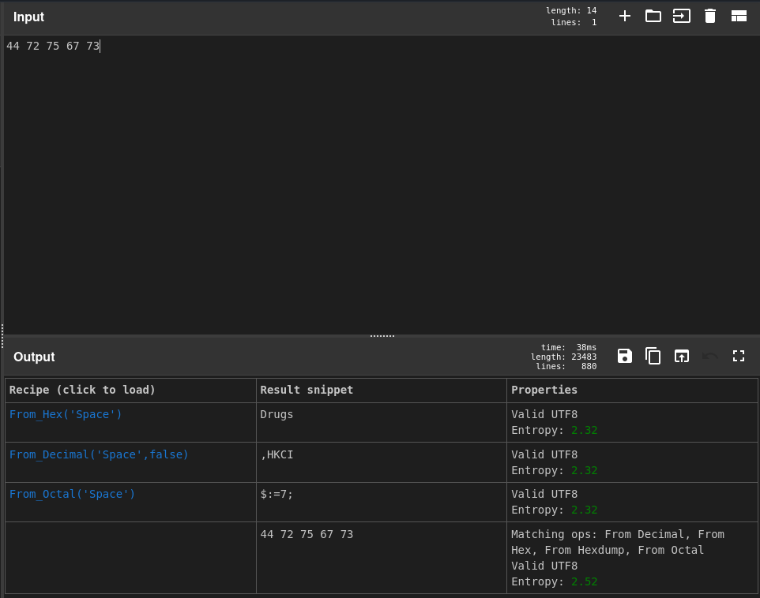
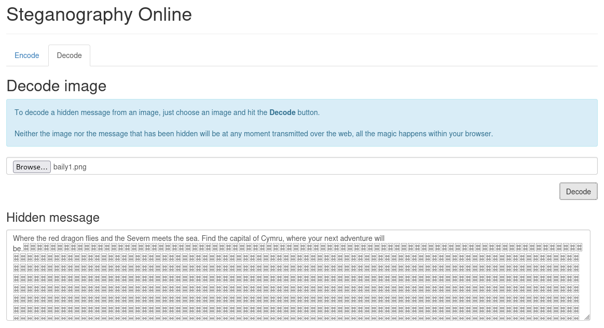

## 📌 Project Description

Operating within the Dark Web requires strict Operational Security (OpSec) and an advanced understanding of cryptographic obfuscation. This project demonstrates a comprehensive Threat Intelligence operation aimed at dismantling the remnants of a major UK-based drug trafficking network.

The objective was to infiltrate a newly established `.onion` hidden service used by the syndicate's mastermind. The mission required bypassing custom authentication mechanisms, deciphering hexadecimal and Base64 communications, tracking illicit financial transactions, and uncovering physical congregation points using steganography.

## 🛠️ Tools & Methodology

- **Tools:** Tor Browser, Virtual Private Network (VPN), Browser Developer Tools (Console), CyberChef, Online Steganography Decoder.
- **Concepts:** Dark Web Navigation, Operational Security (OpSec), DOM Manipulation / Authentication Bypass, Cryptography (Base64 & Hexadecimal), Steganography Extraction.

---

## 🏢 Operational Scenario

Following the successful takedown of a major narcotics marketplace on the TOR network, critical intelligence indicated that one of the mastermind developers evaded capture. They established a covert hub to "tell stories" of criminal exploits while secretly continuing their operations.

As a _Threat Intelligence Analyst_ assisting law enforcement, my mission was to infiltrate this hidden platform (`http://panznjcktrpezyln...`), gather hard evidence of their continued involvement in drug trafficking, and extract actionable intelligence regarding their physical locations and financial transactions.

---

## 🚀 Investigation Phases

### Phase 1: OpSec & Platform Infiltration

- **Strict OpSec Posture:** Before attempting to access the `.onion` address, I established a secure environment by routing my host machine through a hardened VPN before launching the Tor browser. This ensured my ISP could not detect my Tor node connection.
- **Authentication Bypass:** Upon reaching the landing page, I was presented with a login barrier. Suspecting a client-side vulnerability, I right-clicked and selected "Inspect Element" to access the browser's Developer Tools.
- **Credential Generation:** Navigating to the `Console` tab, I executed a hidden internal function: `generateUserCredentials()`. The script returned a Base64 encoded string. I utilized **CyberChef** (using the _From Base64_ recipe) to decode the payload, successfully extracting valid login credentials (`KF7ybuD1:Alyhfot0V9VIWm6W`) and infiltrating the platform.

### Phase 2: Cryptographic Decoding & Network Mapping

- **Deciphering Pinned Posts:** Once inside the dashboard, I noticed three pinned posts whose titles were obfuscated in hexadecimal strings. I extracted these strings and ran them through CyberChef (_From Hex_), revealing the ASCII titles: **"Drugs"**, **"Pleasure"**, and **"Drops"**. This provided immediate evidence of their ongoing illicit activities.
- **Syndicate Cross-Referencing:** Monitoring the internal message board, I investigated a post by a user named `Basilisk95`. Following a hyperlinked breadcrumb in their message, I uncovered a connection to another hidden site operated by a notorious hacking group known as **Midnite**, expanding our intelligence on the syndicate's cyber affiliates.

### Phase 3: Financial Forensics & Identity Deanonymization

- **Transaction Log Discovery:** Scouring the site's layout, I identified a critical Operational Security flaw made by the site administrator. Under the "Recent Transactions" section, a hyperlink labeled `$7,000` was mistakenly left publicly accessible.
- **Evidence Extraction:** Clicking the link exposed a highly sensitive digital invoice, revealing a customer’s full name, private email address, and the specific illicit purpose of the massive transaction.
- **Stolen Goods Trade:** In a separate forum thread regarding the sale of stolen car parts, I found another hexadecimal string embedded in the post. Decoding this string exposed the exact email address used by the illicit vendor to conduct business.

### Phase 4: Steganography & Physical Location Tracking

- **The Party Lead:** A user named `PJ` posted an invitation regarding an upcoming illegal gathering—a prime opportunity for law enforcement to conduct a physical raid. However, the location was hidden.
- **Steganography Extraction:** I downloaded the promotional image attached to PJ's post and processed it through an open-source Steganography Decoder (`stylesuxx.github.io`).
- **Solving the Cipher:** The extraction process did not yield a direct address, but rather a textual riddle. By analyzing the geographic and cultural clues within the riddle, I successfully pinpointed the exact city where the criminal gathering would take place: **Cardiff, UK**.

---

## 🎯 Results & Key Takeaways

- **Client-Side Vulnerability Exploitation:** Demonstrated the ability to inspect Document Object Models (DOM) and execute hidden JavaScript functions via the browser console to bypass custom authentication on the Dark Web.
- **Advanced Cryptanalysis:** Showcased high proficiency in rapidly identifying and deciphering multiple layers of obfuscation (Base64 and Hexadecimal) to extract cleartext intelligence.
- **Digital to Physical Tracking:** Successfully bridged the gap between cyberspace and the physical world by extracting hidden steganographic data and solving a geographic riddle, providing law enforcement with an actionable location (Cardiff) for a physical raid.
