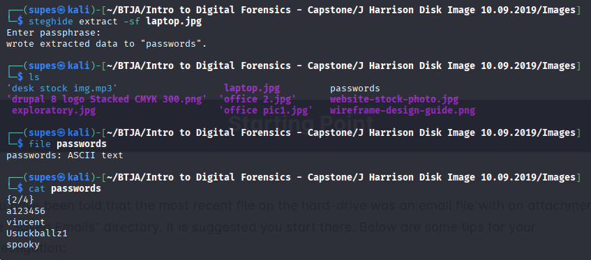
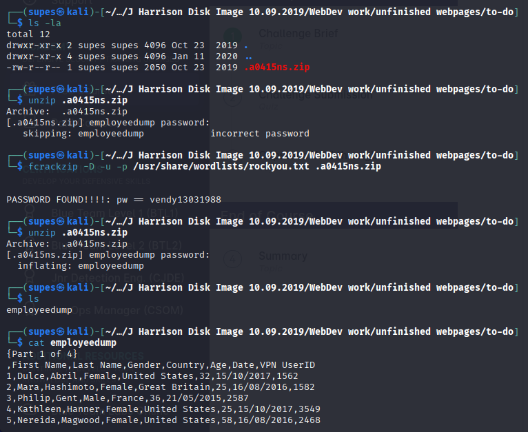
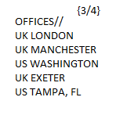
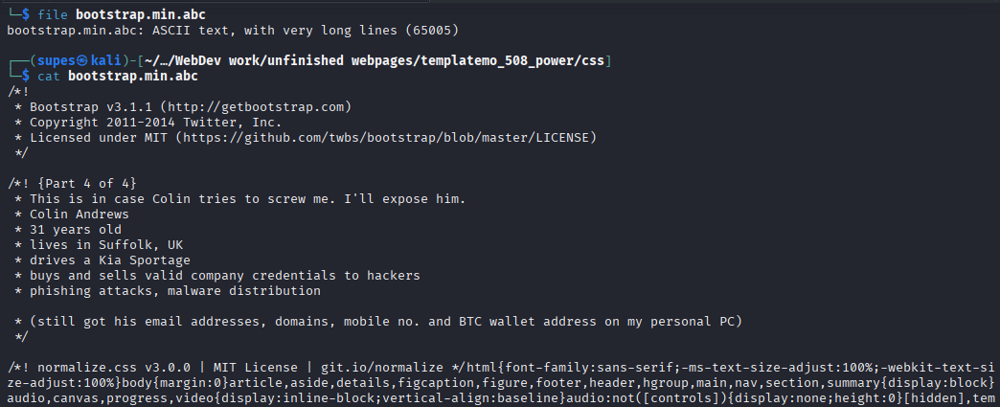

## 📌 Project Description

In the realm of Incident Response, identifying what data a malicious insider has stolen requires rigorous digital forensics. This project demonstrates a comprehensive forensics investigation on a suspect's hard drive image to uncover hidden evidence of data exfiltration.

The objective was to navigate a raw Linux file system, bypass deliberate obfuscation techniques, and retrieve four specific pieces of exfiltrated evidence. The investigation required the application of advanced command-line techniques, steganography extraction, password cracking, and file signature validation.

## 🛠️ Tools & Methodology

- **Tools:** Kali Linux CLI, `steghide`, `fcrackzip`, `strings`, `file`.
- **Concepts:** Disk Image Analysis, Steganography, Magic Bytes (File Signatures) Analysis, Password Cracking, Directory Traversal, Hidden File Detection.

---

## 🏢 Business Scenario

The Security Operations Center (SOC) received an anonymous report that an internal user was actively exfiltrating proprietary data from the company. An image of the user’s hard drive was captured, and I was assigned to analyze a perfect copy of this image.

My objective was to comb through the file system and uncover **four hidden pieces of evidence** confirming malicious activity, overcoming the suspect's attempts to conceal the data through misnamed extensions, hidden directories, and password protection.

---

## 🚀 Investigation Phases & Findings

### Phase 1: The Initial Lead & Steganography (Evidence 2/4)

- **The Lead:** Following an initial intelligence tip, I began my investigation in the `Saved Emails` directory. By utilizing the `strings` command on a suspicious attachment named `form1.jpg`, I extracted hidden ASCII text that revealed a steganography password: `password`.
- **Steganography Extraction:** Armed with this password, I pivoted to the `Images` directory. I used the `steghide extract -sf laptop.jpg` command against a file with an unusually large byte size for its dimensions.
- **Findings:** The extraction was successful, revealing a hidden text file named `passwords`. This file contained a **List of employee passwords** as our first confirmed piece of exfiltrated data **[Evidence 2/4]**.

### Phase 2: Methodical Traversal & Password Cracking (Evidence 1/4)

- **Hidden File Detection:** I adopted a methodical approach, running `ls -la` in every directory to ensure no hidden files (files prepended with a dot `.`) slipped past the investigation.
- **The Discovery:** Inside an empty-looking directory named `to-do`, the `ls -la` command revealed a hidden, password-protected `.zip` archive.
- **Password Cracking:** Lacking a known password, I utilized `fcrackzip` combined with the `rockyou.txt` dictionary wordlist to brute-force the archive's password.
- **Findings:** Upon successfully unlocking the archive, I discovered a file named `employee dump`. It contained massive amounts of Personally Identifiable Information (PII) belonging to employees, which definitively should not have resided on this user’s machine **[Evidence 1/4]**.

### Phase 3: File Signature & Magic Bytes Analysis (Evidence 3/4)

- **Identifying Anomalies:** Continuing the directory traversal, I stumbled upon an unusually placed `.xml` file named `posidon.xml` within the `Week 10` directory.
- **File Signature Validation:** Instead of blindly trusting the file extension, I executed the Linux `file` command against `posidon.xml`. The output revealed that its "magic bytes" actually corresponded to a **PNG image data**, not XML text.
- **Findings:** I renamed the file extension to `.png` and opened it in an image viewer. The image explicitly displayed **Office locations** which is classified company data intentionally hidden by the suspect **[Evidence 3/4]**.

### Phase 4: Web Directory Anomaly Detection (Evidence 4/4)

- **The Roadblock & Persistence:** After hitting a temporary roadblock, I decided to deep-dive into the complex web development directories where malicious insiders often hide files in plain sight.
- **The Anomaly:** Deep within `WebDev work/unfinished webpages/templatemo_508_power/css`, I spotted a severe inconsistency. Amidst standard `.css` stylesheet files, there was a file named `bootstrap.min.abc`.
- **Extraction:** I utilized the `file` command to confirm it was standard ASCII text, followed by the `cat` command to output its contents to the terminal.
- **Findings:** The file was a masqueraded text document containing the highly sensitive **Personal information of Colin** (a targeted victim) **[Evidence 4/4]**.

---

## 🎯 Results & Key Takeaways

- **Comprehensive Endpoint Forensics:** Successfully recovered all 4 pieces of exfiltrated evidence by overcoming various data obfuscation techniques used by the malicious insider.
- **Defense Against Obfuscation:** Demonstrated that file extensions are arbitrary and easily manipulated by attackers. Validating file types using the `file` command (Magic Bytes analysis) is a critical forensic practice.
- **Methodical Command-Line Proficiency:** Showcased high-level proficiency in Kali Linux CLI, proving that disciplined directory traversal (`ls -la`), brute-forcing (`fcrackzip`), and steganography analysis (`steghide`) are highly effective in uncovering deep-rooted compromises.
