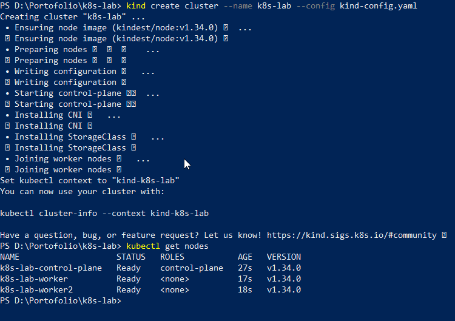
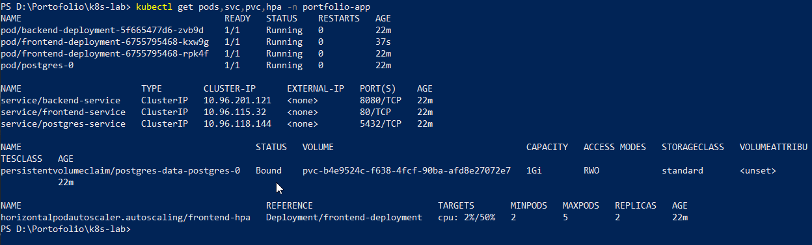
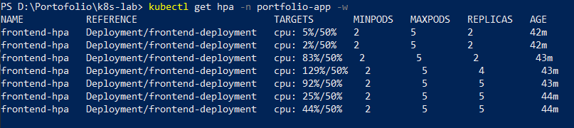
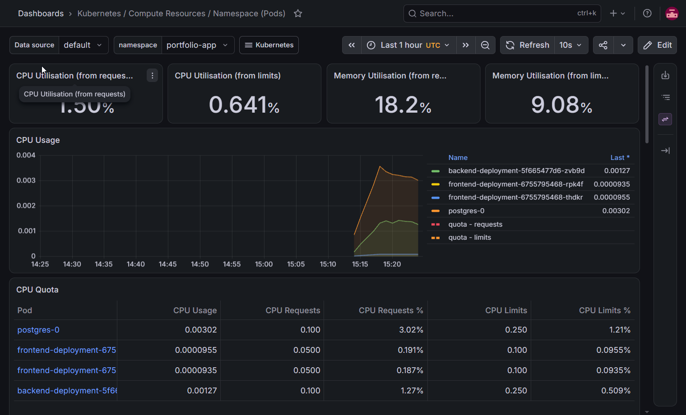
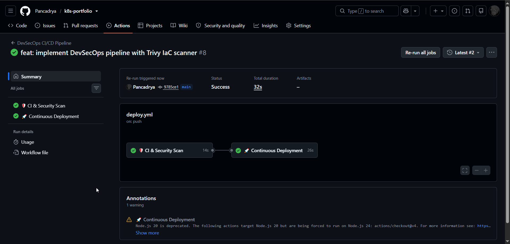
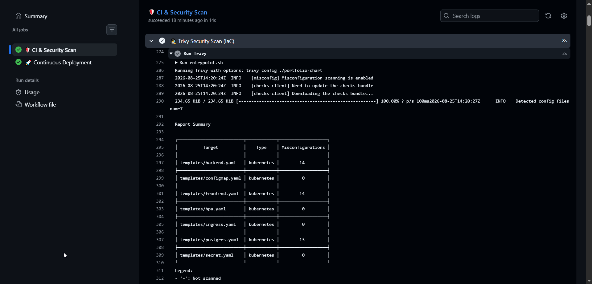
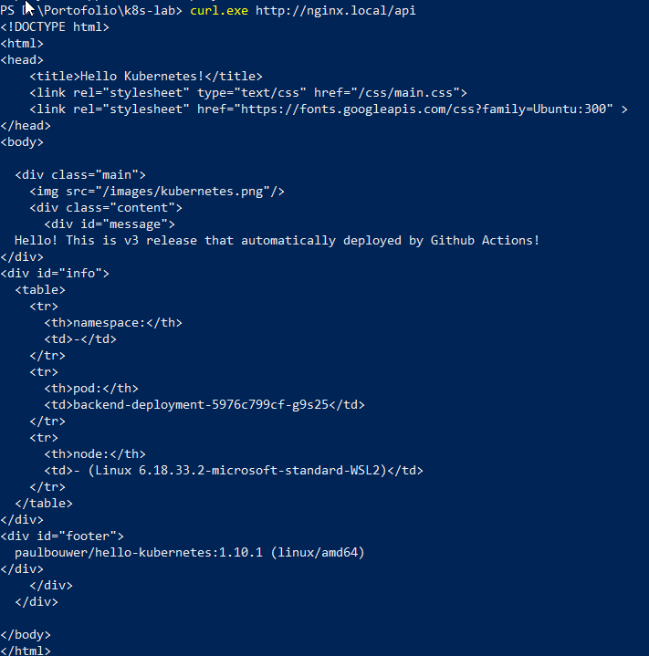

## 📌 Project Description

In the cloud-native ecosystem, managing microservices manually through imperative commands is inefficient and risky. This project demonstrates the implementation of **Site Reliability Engineering (SRE)** and **DevSecOps** principles by building a fully automated, scalable, and secure Kubernetes architecture.

The primary objective of this project is to transition from traditional manual cluster management to an **Kubernetes application packaging and release management** approach using Helm. Furthermore, the project orchestrates a robust CI/CD pipeline that automatically scans for security vulnerabilities before seamlessly deploying updates to a local Kubernetes cluster via a self-hosted runner.

## 🛠️ Tech Stack & Tools

- **Container Orchestration:** Kubernetes (KinD - Kubernetes in Docker).
- **Kubernetes Packaging & Release Management:** Helm (Package Manager).
- **CI/CD & Automation:** GitHub Actions (with Self-Hosted Runner).
- **DevSecOps (Security):** Trivy (IaC & Vulnerability Scanner).
- **Monitoring & Observability:** Prometheus, Grafana, Metrics Server.
- **Networking:** NGINX Ingress Controller.

---

## 🏢 Business Scenario

A modern tech startup requires a highly available application infrastructure that can automatically scale during traffic spikes and scale down to save costs. Previously, deployments were done manually, leading to human errors, and there was zero visibility into the cluster's health or security posture.

To solve this, a comprehensive Kubernetes ecosystem was engineered. This solution empowers developers to push code that is automatically audited for security misconfigurations. If secure, the pipeline deploys the application with self-healing capabilities, dynamic autoscaling, and real-time monitoring dashboards for the Operations team.

---

## 🚀 Implementation Steps

### Phase 1: Local Kubernetes & Core Networking

The foundation of this architecture relies on a lightweight local Kubernetes cluster provisioned via **KinD**. To expose internal services to the outside world, an **NGINX Ingress Controller** was deployed, acting as the primary entry point and routing HTTP traffic to the appropriate backend services.


_(Catatan: Gunakan screenshot saat Anda menjalankan perintah kind create cluster atau saat Ingress Controller berstatus Running)_

### Phase 2: Kubernetes Packaging & Release Management using Helm

Standard Kubernetes YAML manifests (Deployments, Services, ConfigMaps) were refactored into dynamic **Helm Charts**. This transition allows for version-controlled infrastructure templates, environment-specific configurations via `values.yaml`, and simplified release management.

```bash
# Deploying the application via Helm
helm upgrade --install portfolio-release ./portfolio-chart/ \
  --namespace portfolio-app --create-namespace
```



### Phase 3: High Availability & Dynamic Autoscaling

To ensure the application can handle sudden traffic spikes, **Metrics Server** was integrated to expose cluster resource utilization. A **Horizontal Pod Autoscaler (HPA)** was configured to monitor CPU loads.

During a simulated load test, the CPU utilization exceeded the 50% threshold, successfully triggering the HPA to dynamically scale the deployment from 2 replica to multiple replicas to maintain optimal performance.



### Phase 4: Observability & Real-Time Monitoring

Operating a cluster without visibility is akin to flying blind. The industry-standard `kube-prometheus-stack` was deployed via Helm to establish a complete observability suite. This automated the provisioning of **Prometheus** (time-series database) and **Grafana** (visualization dashboard).

The operations team now has access to out-of-the-box Kubernetes dashboards to monitor node health, pod resource allocation, and network traffic in real-time.



### Phase 5: DevSecOps CI/CD Pipeline Integration

A dual-stage CI/CD pipeline was engineered using **GitHub Actions**, separating security validation from the deployment execution.

**1. CI & Security Scan (Cloud Runner):**
Before any deployment, the code is audited. **Trivy** scans the Helm charts for misconfigurations (IaC scanning), identifying missing resource limits or elevated privileges (e.g., `allowPrivilegeEscalation`).

**2. Continuous Deployment (Self-Hosted Runner):**
If the security audit passes, the deployment job is triggered. Utilizing a local Self-Hosted Runner, GitHub securely executes the `helm upgrade` command directly against the local cluster without exposing the cluster's kubeconfig to the public internet.





To validate the automated deployment to the local Kubernetes cluster, a configuration change was pushed to the repository, which automatically triggered the pipeline and updated the application's ConfigMap successfully.



---

## 🎯 Results & Key Takeaways

- **Security First (DevSecOps):** Integrated Trivy into the CI pipeline, shifting security "left" to catch Kubernetes misconfigurations early in the development cycle.
- **Automated Deployment:** Achieved fully automated, seamless deployments using GitHub Actions and Helm, effectively eliminating manual `kubectl apply` commands.
- **Enterprise Observability:** Established a robust monitoring system using Grafana and Prometheus, providing critical visibility into infrastructure health.
- **Zero-Budget Architecture:** Successfully built an production-inspired DevOps ecosystem utilizing 100% open-source tools and self-hosted runners, proving that high-end DevOps practices can be implemented efficiently and cost-effectively.
