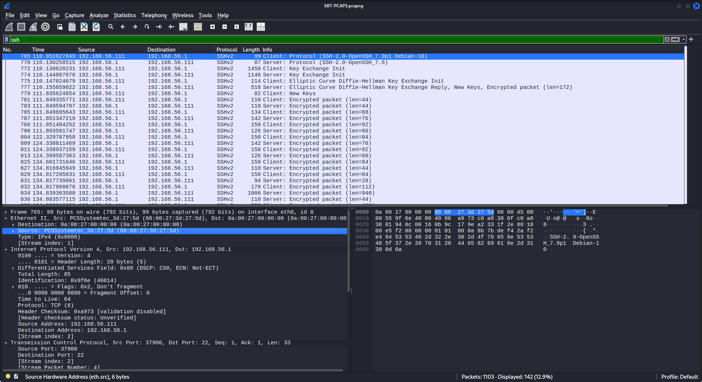
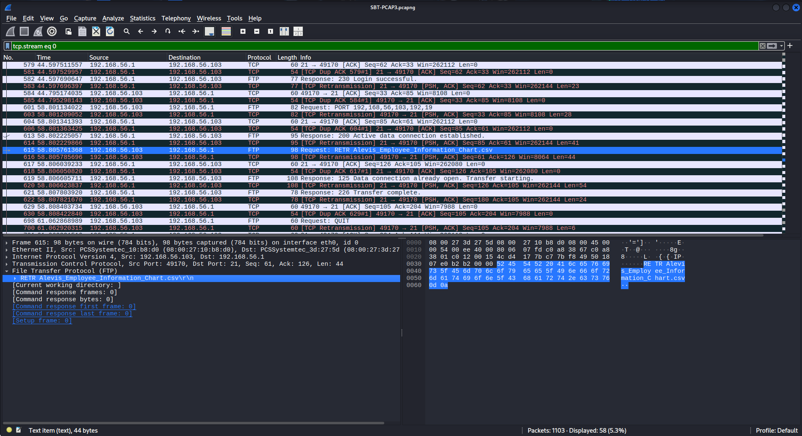
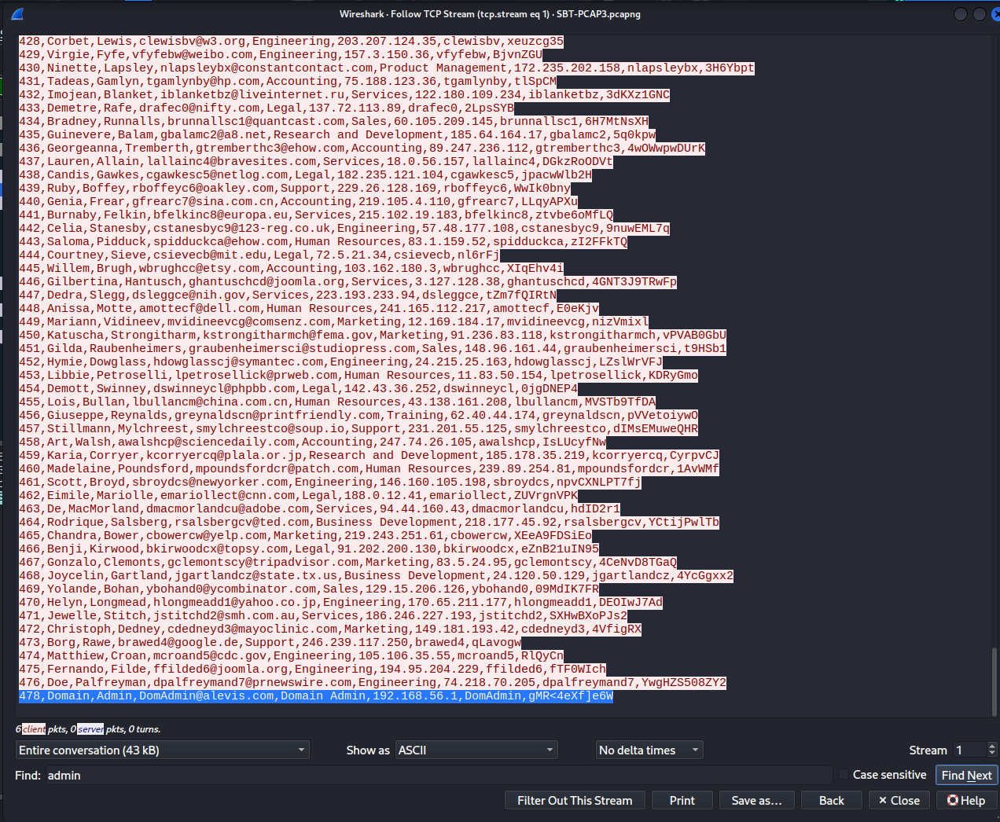

## 📌 Project Description

In cybersecurity operations, detecting and reconstructing an insider threat or physical breach requires precise network traffic analysis. This project demonstrates network forensics using **Wireshark** to analyze a packet capture (PCAP) from a compromised internal network.

The primary objective of this analysis was to identify the attacker's hardware footprint, determine the attack vector used to intercept internal communications, reconstruct exfiltrated files from raw TCP streams, and assess the extent of the credential compromise.

## 🛠️ Tools & Methodology

- **Tools:** Wireshark.
- **Concepts:** Network Forensics, Protocol Analysis (SSH, FTP), Traffic Filtering, TCP Stream Reconstruction, Cleartext Credential Sniffing.
- **Attack Vectors Analyzed:** Unauthorized Physical Access, Man-in-the-Middle (MITM) Attack, Data Exfiltration.

---

## 🏢 Business Scenario

**Alexis** is a fictional cybersecurity company with thousands of employees. An attacker gained unauthorized physical entry into its premises and connected a rogue laptop to an unused port on a network switch, granting them access to the company’s internal network.

Within this network resides a central server storing critical proprietary data. In this packet capture, the attacker attempted to collect SSH credentials to log into the central server. As a _Security Analyst_, I was tasked with dissecting the PCAP file to retrace the attacker's steps, identify the stolen assets, and recover the compromised credentials.

---

## 🚀 Investigation Phases

### Phase 1: Attacker Identification & Attack Vector Analysis

- **Attacker Hardware Fingerprinting:** Filtered the traffic for the `ssh` protocol to narrow down the packets to 142. By utilizing `Statistics > Conversations`, I confirmed only two devices were communicating via SSH. Inspecting the Ethernet frame details of the initial communication packets revealed the attacker's MAC address.
  - **Findings:** The attacker's MAC address is `08:00:27:3d:27:5d`.

    

- **Attack Methodology:** Analyzed the traffic behavior between the central server and the internal host. The packet patterns indicated that the attacker positioned themselves between the two endpoints to intercept and sniff the traffic.
  - **Findings:** The attacker utilized a **Man-in-the-Middle (MITM)** attack to listen in on the internal conversations.

### Phase 2: Data Exfiltration & Payload Reconstruction

- **Identifying Exfiltrated Assets:** Navigated to `Statistics > Protocol Hierarchy` to get a high-level overview of all protocols used in the PCAP. Noticed anomalous FTP traffic operating under TCP. Applied the `ftp` display filter, selected the relevant packet, and followed the TCP stream to observe the data transfer commands.
  - **Findings:** The attacker successfully downloaded a file named `Alevis_Employee_Information_Chart.csv` from the central server.

    

### Phase 3: Credential Compromise & Impact Assessment

- **TCP Stream Data Extraction:** Followed the specific TCP stream (Stream 1) of the FTP data channel to view the actual contents of the exfiltrated CSV file in plaintext.
- **Targeted Employee Identification:** Investigated the 5th column of the CSV file which contained department information. Searched the stream for the targeted employee, "Borden Danilevich", to assess their access level and department.
  - **Findings:** Borden Danilevich works in the **Sales** department.
- **Extracting Sniffed Credentials:** Searched the exfiltrated CSV data for the "admin" user to find the compromised Domain Administrator SSH password. Cleaned up the raw stream output by removing trailing gibberish characters associated with the packet formatting.
  - **Findings:** The Domain Administrator's SSH password is `gMR<4eXf]e6W`.

    

---

## 🎯 Results & Key Takeaways

- **Physical Breach Detection:** Demonstrated the ability to map physical layer identifiers (MAC Addresses) to rogue devices plugged into enterprise switches.
- **Protocol Reconstruction Proficiency:** Showcased advanced Wireshark skills by navigating Protocol Hierarchies, filtering FTP control/data channels, and reconstructing raw TCP streams to recover exfiltrated corporate files.
- **Credential Recovery & Impact Analysis:** Successfully extracted the compromised Domain Administrator credentials from intercepted network traffic, providing critical intelligence for immediate password rotation and incident containment.
