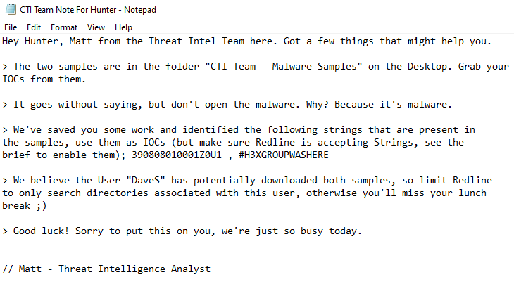
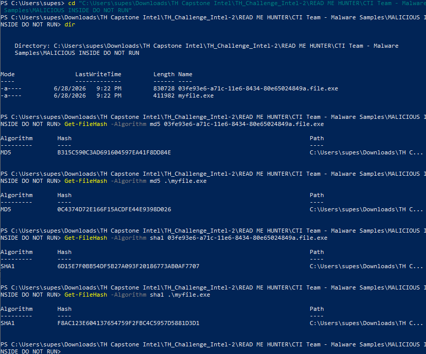
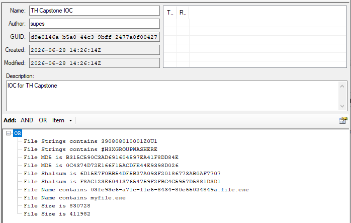
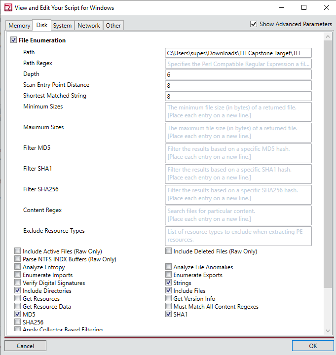
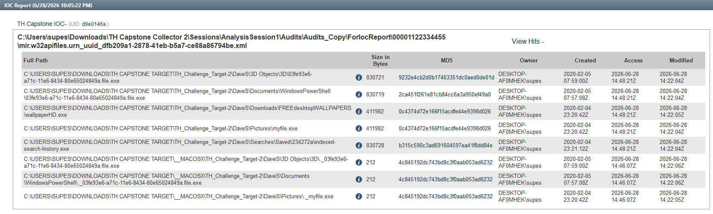

## 📌 Project Description

In the field of Digital Forensics and Incident Response (DFIR), proactively hunting for adversaries inside a network is a critical capability. This project demonstrates a comprehensive Threat Hunting operation targeting a compromised remote endpoint.

The objective was to analyze two live malware samples, extract their Indicators of Compromise (IOCs), build a custom threat hunting rule set using **Mandiant IOC Editor**, and execute a targeted sweep across a forensic disk image using **Mandiant Redline**.

## 🛠️ Tools & Methodology

- **Tools:** Mandiant Redline, Mandiant IOC Editor, Isolated Windows 10 VM.
- **Concepts:** Threat Hunting, Static Malware Analysis, IOC Generation (MD5/SHA1 Hashes, File Sizes, Strings), Operational Security (Malware Sandboxing).

---

## 🏢 Operational Scenario

I was operating as a _Junior Threat Hunter_ during a major organizational crisis. The primary Threat Intelligence team was overwhelmed dealing with a massive data breach involving leaked employee credentials. Meanwhile, we received two distinct malware samples tied to the incident.

Given the senior team's bandwidth, I was authorized to conduct an independent live hunt on a disk image retrieved from a remote branch office. My mission was to safely analyze the raw malware, generate my own IOCs, integrate hints from the Threat Intel team, and report on the total infection scope within the remote system.

> **⚠️ Operational Security (OpSec) Note:** _This operation involved handling real, weaponized malware. To prevent accidental execution or automated quarantine by host security controls, the entire investigation was conducted within a strictly isolated Windows Virtual Machine with Windows Defender, Bing secure download, and active threat protections explicitly disabled._

---

## 🚀 Investigation Phases

### Phase 1: Malware Handling & IOC Generation

- **Static Analysis:** Working within the sandboxed environment, I conducted static analysis on the two provided malware samples.
- **Artifact Extraction:** I extracted crucial file attributes to serve as my hunting foundation. This included cryptographic hashes (MD5 and SHA-1), precise file sizes, distinctive filenames, and embedded ASCII/Unicode strings.
- **Intel Integration:** I cross-referenced my extracted data with a briefing note provided by the Threat Intel analysts to ensure my IOC baseline was comprehensive and accounted for known adversary variations.

### Phase 2: Building the IOC Framework

- **Mandiant IOC Editor:** I launched the Mandiant IOC Editor to translate my raw findings into a structured, machine-readable format (`.ioc` files).
- **Logic Configuration:** I constructed logical operators (AND/OR) tying together the MD5/SHA-1 hashes, file sizes, and specific strings. This ensured the hunting script would accurately flag the malware even if the adversary attempted superficial modifications (like changing the filename).

### Phase 3: Redline Collector Configuration & Execution

- **Custom Collector Script:** I imported my custom IOCs into **Mandiant Redline** to generate an IOC Search Collector.
- **Advanced Tuning:** Recognizing that standard scans might miss obfuscated variants, I edited the collector's script. Navigating to the _Disk_ tab, I explicitly mandated the collector to parse for **Strings** and **SHA-1** hashes across the file system.
- **Execution:** I executed the tailored Redline collector against the target directory (the remote disk image) and waited for the engine to parse the file system against my criteria.

### Phase 4: Threat Intelligence & Findings Analysis

Upon reviewing the generated Redline IOC Reports, I successfully mapped the extent of the infection on the remote machine.

- **Infection Scope:** The custom IOCs successfully detected exactly **8 pieces of malware** scattered across the disk image.
- **Masquerading Techniques:** I discovered a malicious executable actively attempting to camouflage itself as a high-definition image file, specifically named `wallpaperHD.exe`.
- **Lateral Placement:** The adversary did not restrict themselves to system folders. I confirmed the presence of active malware hidden deep within user directories, specifically locating a payload inside `/DaveS/Pictures`.
- **Payload Duplication:** Through hash analysis, I identified that the MD5 hash `0c4374d72e166f15acdfe44e9398d026` appeared in two distinctly named files. This indicated that the attacker had duplicated the exact same payload in different locations to ensure persistence.

---

## 🎯 Results & Key Takeaways

- **Live Malware Handling Proficiency:** Demonstrated strict adherence to OpSec protocols by successfully managing and analyzing real malware within a purposely vulnerable, isolated sandbox without causing collateral damage.
- **Advanced DFIR Tooling:** Showcased practical expertise in the Mandiant ecosystem (IOC Editor and Redline), transforming raw malware artifacts into deployable enterprise threat hunting scripts.
- **Threat Actor Profiling:** Identified adversary Tactics, Techniques, and Procedures (TTPs), specifically their use of masquerading (`.exe` disguised as images) and payload duplication to maintain persistence within standard user directories.
