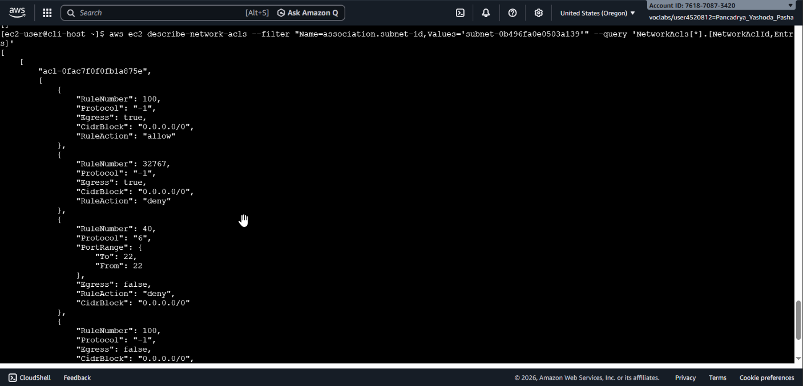
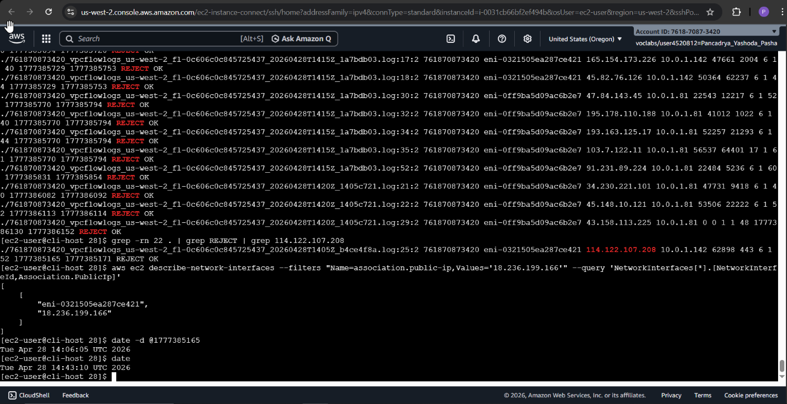

## 📌 Project Description

Diagnosing network issues in a cloud environment requires deep visibility and a robust understanding of architecture. This project demonstrates a programmatic network troubleshooting workflow using the AWS Command Line Interface (CLI) to identify and rectify misconfigurations in routing and security layers (Network ACLs).

After restoring connectivity, I leveraged **VPC Flow Logs** to conduct network forensics. I extracted and analyzed raw IP traffic logs stored in Amazon S3 using Linux utilities to historically validate which packets were rejected and why.

## 🛠️ Tech Stack & AWS Services

- **Networking & Content Delivery:** Amazon VPC, Route Tables, Internet Gateways, Network Access Control Lists (NACLs).
- **Security & Auditing:** VPC Flow Logs.
- **Storage & Compute:** Amazon S3, Amazon EC2, EC2 Instance Connect.
- **Tools/Concepts:** AWS CLI, Linux Network Forensics (`grep`, `gunzip`, `date`), Traffic Analysis, Subnet Routing.

---

## 🏢 Business Scenario

A web server residing in a Public Subnet suddenly became inaccessible via web browsers (HTTP) and remote terminals (SSH). As a _Cloud Engineer_, I was restricted from using the AWS Management Console and required to investigate the issue programmatically from an isolated CLI Host instance. My task was to discover the network misconfigurations, remediate them, and prove via network logs that traffic packets were being actively blocked prior to the fixes.

---

## 🚀 Implementation Steps

### Phase 1: VPC Flow Logs Initialization (AWS CLI)

- Provisioned a dedicated Amazon S3 bucket (`flowlog######`) to serve as the log storage destination.
- Executed the `aws ec2 create-flow-logs` command to enable IP traffic tracking (capturing both `ACCEPT` and `REJECT` statuses) across all network interfaces within the VPC.

### Phase 2: Route Table Investigation & Remediation (HTTP Access)

- Analyzed the web server timeout issue using `nmap` and validated the Security Group rules.
- Inspected routing configurations using `aws ec2 describe-route-tables` and discovered that the Public Subnet lacked a route to the Internet Gateway (IGW).
- Remediated internet connectivity by injecting a new route (`0.0.0.0/0`) into the Route Table using the `aws ec2 create-route` command, successfully restoring HTTP access to the website.

### Phase 3: Network ACL Investigation & Remediation (SSH Access)

- Despite the web server being online and the Security Group permitting Port 22, SSH access continued to fail.
- Analyzed subnet-level network controls using `aws ec2 describe-network-acls` and discovered a rogue Deny rule interfering with inbound traffic on Port 22.
- Eradicated the faulty NACL entry using `aws ec2 delete-network-acl-entry`, successfully restoring EC2 Instance Connect functionality.

### Phase 4: Traffic Log Forensics (Traffic Analysis)

- Bulk-downloaded and extracted the compressed VPC Flow Logs (`.log.gz`) from Amazon S3 to the local machine.
- Utilized Linux forensic techniques (`grep -rn`) to parse through thousands of log lines, filtering for packets with a `REJECT` status on port `22` originating from my local IP address.
- Converted UNIX timestamps within the logs using the `date -d` utility to historically validate the exact timeframe of the blocking incidents.

---

## 🎯 Results & Key Takeaways

- **CLI-First Network Troubleshooting:** Demonstrated advanced competency in navigating, diagnosing, and modifying Amazon VPC components (Route Tables, NACLs, IGWs) exclusively using the AWS CLI.
- **Defense in Depth Comprehension:** Showcased a deep understanding of how Network ACLs (subnet-level, stateless) and Security Groups (instance-level, stateful) interact to govern network traffic flows.
- **Operational Intelligence:** Transformed raw VPC Flow Log data into actionable forensic evidence to validate network anomalies.
