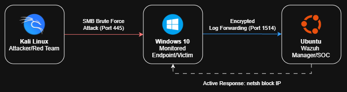
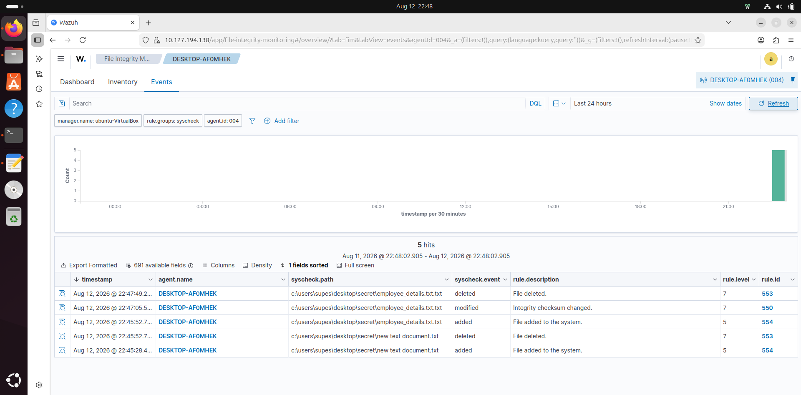
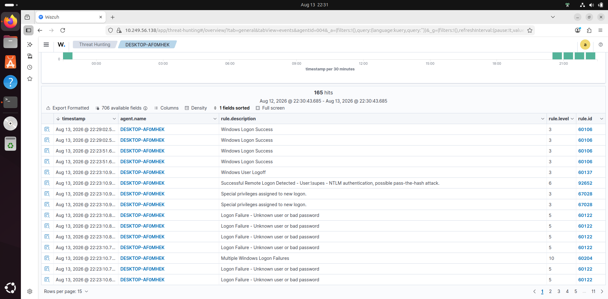
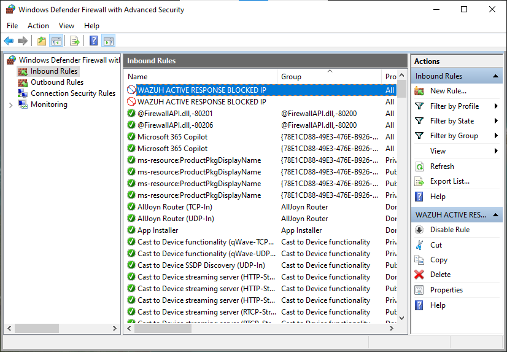

## 📌 Executive Summary

A Security Operations Center (SOC) depends on more than simply collecting logs; it requires transforming telemetry into actionable intelligence and immediate containment.

This project demonstrates the end-to-end engineering of a miniature SOC environment. By simulating real-world attacks (Red Team) and implementing automated defenses (Blue/Purple Team), this lab showcases a workflow that demonstrates how automated response can reduce containment time from manual intervention to near-immediate machine execution.

**Key Achievements:**

- Configured Windows File Integrity Monitoring (FIM).
- Correlated SMB brute-force attacks to MITRE ATT&CK frameworks.
- Automated IP blacklisting via Wazuh Active Response.
- Conducted a monitoring gap analysis to define future network telemetry needs.

---

## 🛠️ Tools & Methodology

- **SIEM:** Wazuh 4.12.0
- **Endpoint:** Windows 10 + Wazuh Agent 4.12.0
- **Security Testing:** Kali Linux (NetExec, Nmap)
- **Virtualization & Network:** Oracle VirtualBox (Bridged Adapter)
- **Response Mechanism:** Windows Defender Firewall (`netsh`)
- **Core Concepts:** SIEM, EDR, Threat Detection, SOAR (Security Orchestration, Automation, and Response), MITRE ATT&CK.

---

## 🏗️ Architecture & Telemetry Flow

The environment consists of three isolated virtual machines acting in a classic attacker-defender topology.



**📝 Environment Note:**
Because this lab was built in a dynamic home-lab environment and conducted across multiple sessions, the IP addresses shown in the screenshots may vary slightly from the architecture table.

- **Attacker (Kali):** `10.x.x.x`
- **Target (Windows):** `10.x.x.x`
- **Wazuh Manager (Ubuntu):** `10.x.x.x`

The core detection and correlation logic remains identical regardless of the IP lease.

<details>
<summary>Click to view raw telemetry flow</summary>

```text
[Kali Linux] --(Attack Traffic)--> [Windows 10]
                                        |
                               (Security Events)
                                        |
                                        v
                                 [Wazuh Agent]
                                        |
                               (Encrypted Log Forwarding - Port 1514)
                                        |
                                        v
[Windows Firewall] <--(Active Response)--- [Wazuh Manager (Ubuntu)]
```

</details>

---

## 🔐 Scenario 1: File Integrity Monitoring (FIM)

**Objective:** Verify real-time detection of unauthorized modifications to critical system files.

**Methodology:**
The Wazuh Agent was configured to actively monitor critical Windows directories, in this lab `secret` folder. When a file is modified, the agent computes the cryptographic hash and forwards the anomaly to the Manager.

**Result:**
The FIM pipeline successfully captured unauthorized file modifications, instantly flagging the exact file path, modification timestamp, and the specific changes made.



---

## 🔑 Scenario 2: SMB Authentication Attack (MITRE T1110)

**Objective:** Detect lateral movement attempts via SMB brute-force attacks and correlate them into high-severity alerts.

**Attack Simulation:**
NetExec was deployed from Kali Linux to bombard the Windows endpoint (Port 445) with credential combinations.

**Detection Logic:**
Instead of treating each failed login as an isolated event, Wazuh was utilized to correlate the telemetry. Rule **60204** was triggered, identifying multiple failed logons originating from a single source IP (`10.x.x.x`) within a 240-second window.

```text
Rule ID:       60204
Level:         10
Description:   Multiple Windows Logon Failures
MITRE ATT&CK:  T1110 (Brute Force)
```

**Result:**
The SIEM successfully aggregated raw Windows Event ID `4625` logs into a unified, high-priority SOC alert.



---

## 🚨 Scenario 3: Automated Active Response (SOAR)

**Objective:** Move beyond passive detection by implementing a SOAR-like (Security Orchestration, Automation, and Response) mechanism to temporarily contain the threat.

**Response Architecture:**
The Wazuh Manager was programmed to execute a localized response on the Windows endpoint whenever Rule `60204` triggered.

```xml
<active-response>
    <command>netsh</command>
    <location>local</location>
    <rules_id>60204</rules_id>
    <timeout>300</timeout>
</active-response>
```

**Result:**
Once the attack reached the defined threshold, Wazuh automatically instructed the Windows agent to execute a `netsh` command. This instantly created an Inbound Block Rule in the Windows Defender Firewall against the Kali Linux IP.

The attack was neutralized mid-execution. After the 300-second timeout, the rule automatically dissolved, demonstrating a safe, temporary containment strategy that prevents permanent network lockouts during false positives.



---

## 🔎 Scenario 4: Gap Analysis (Network Reconnaissance)

**Objective:** Test the limits of endpoint-based monitoring against network-layer reconnaissance.

**Experiment:**
A stealth network scan was initiated from Kali Linux using `nmap -Pn 10.44.158.101` to map exposed services (SSH, SMB, MSRPC).

**Finding & Security Gap:**
The scan successfully enumerated the ports, but **no obvious alert was generated in Wazuh.**

Why? The current architecture relies heavily on endpoint logs (Windows Security Events). A port scan interacts with the network stack but does not typically generate a Windows authentication or file event.

**Conclusion:** This "failed" detection is a critical engineering finding. This demonstrates a visibility gap in an endpoint-focused monitoring architecture and motivates adding network telemetry such as NIDS.

---

## 💡 Key Takeaways

1. **Detection is Not Mitigation:** Installing a SIEM provides visibility, but tying detection directly to an automated response (Active Response) is what actually stops a breach in its tracks.
2. **Telemetry Dictates Capability:** The gap analysis proved that you can only detect what you can see. Endpoint logs are blind to pure network reconnaissance.
3. **Safe Containment:** Implementing a timeout-based response (300 seconds) is crucial in production environments to avoid self-inflicted Denial of Service (DoS) due to false positives.

---

## 🚀 The Roadmap: Next Phase

To evolve this miniature SOC into an enterprise-grade architecture, the following capabilities are planned for the next iteration:

1. **Network Intrusion Detection (NIDS):** Integrating Suricata or Zeek to inspect raw packet traffic and cover the blind spot discovered during the Nmap gap analysis.
2. **Cloud Integration:** Extending the Wazuh Manager to ingest cloud-native telemetry (e.g., AWS CloudTrail, VPC Flow Logs) to monitor hybrid-cloud environments.
3. **Alert Notification:** Pushing high-severity alerts from Wazuh to a Slack or Telegram webhook for real-time SOC analyst notification.

---

_This project is a continuous work in progress, demonstrating a hands-on approach to threat detection engineering and incident response._
