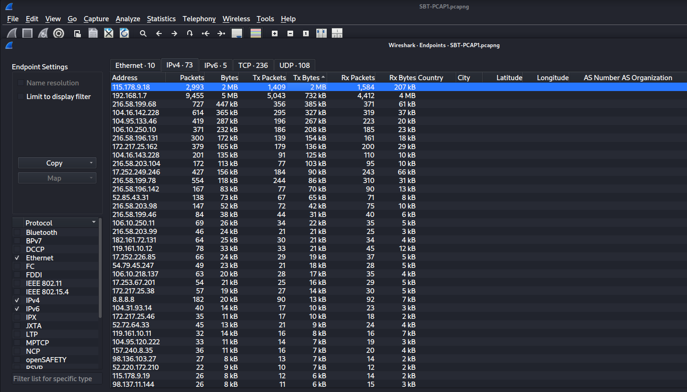
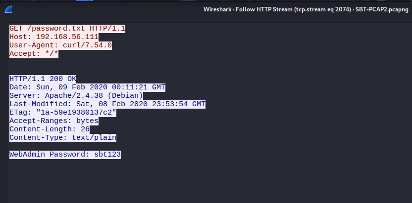
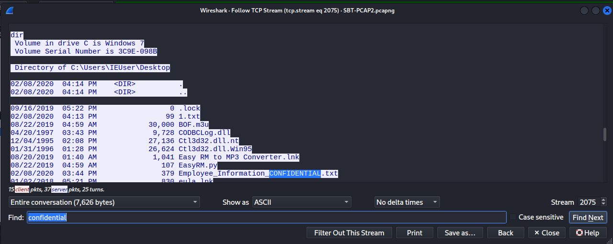

## 📌 Project Description

In cybersecurity operations, the ability to dissect network packet captures (PCAP) is an essential skill for Incident Response. This project demonstrates network forensics using **Wireshark** to analyze two independent PCAP scenarios with escalating levels of difficulty.

The primary objective of this analysis was to baseline normal network traffic in the first scenario, and in the second scenario, to identify anomalies, extract sensitive information transmitted in cleartext, and reconstruct the exact exploitation phases executed by an attacker against a Windows host.

## 🛠️ Tools & Methodology

- **Tools:** Wireshark.
- **Concepts:** Network Forensics, Protocol Analysis (DNS, ICMP, SSDP, FTP, HTTP), Traffic Filtering, Credential Sniffing, Endpoint Statistics.
- **Kill Chain Analysis:** Reconnaissance, Initial Access, Credential Theft, Post-Exploitation.

---

## 🏢 Business Scenario

A Security Operations Center (SOC) intercepted two distinct network packet captures (PCAPs) from different network segments. As a _Security Analyst_, I was tasked with dissecting the traffic to answer critical forensic questions and document the attacker's footprint, ranging from initial protocol usage and external connectivity testing to credential theft and post-exploitation file creation.

---

## 🚀 Investigation Cases

### Case Study 1: Network Baseline & Traffic Analysis (PCAP 1)

_This investigation focused on mapping logical topologies, analyzing traffic volume, and identifying specific network protocols._

- **Specific Protocol Analysis:** Filtered network streams and detected Simple Service Discovery Protocol (SSDP) communications actively running over port `3942`.
- **Connectivity Mapping (ICMP):** Traced external connectivity testing, identifying a host that issued exactly two ICMP Echo Requests (pings) to `8.8.4.4` (Google Public DNS).
- **DNS Traffic Volume:** Filtered and analyzed domain resolution activity, capturing exactly **90** DNS Query Response packets.
- **Endpoint Statistics (Top Talker):** Leveraged Wireshark's Endpoint Statistics and Conversations features to identify `115.178.9.18` as the host that transmitted the highest number of bytes, providing an initial pivot point for anomaly detection.

### Case Study 2: Incident Response & Compromise Tracking (PCAP 2)

_This investigation involved a more complex simulated attack scenario, focusing on tracing an adversary's footprint and data exfiltration._

- **Cleartext Credential Sniffing:** Analyzed TCP/HTTP streams and successfully extracted unencrypted credentials. The compromised **WebAdmin** password was identified as `sbt123`.

- **Attacker Fingerprinting:** Performed banner grabbing on the captured FTP packet streams, confirming the attacker was utilizing an FTP server `pyftpdlib` version **1.5.5**.
- **Initial Exploitation Vector:** Traced the connection patterns to confirm the attacker successfully gained access to the victim's Windows host through port `8081`.
- **Data Exfiltration & Internal Reconnaissance:** Tracked the attacker's movements post-compromise, discovering they targeted a highly sensitive file named `Employee_Information_CONFIDENTIAL.txt`.
- **Post-Exploitation Activity:** Reconstructed the packet timeline to discover that a new log file named `LogFile.log` was created on the Windows host at exactly 4:51 AM, indicating the execution of a malicious script or backdoor installation.

---

## 🎯 Results & Key Takeaways

- **High-Precision Packet Analysis:** Proved competency in leveraging Wireshark (Display Filters, TCP Stream Follow, Endpoint Statistics) to transform thousands of raw packets into actionable threat intelligence.
- **Attack Kill Chain Reconstruction:** Demonstrated the ability to trace an adversary's exact steps, from the entry point (Port 8081) and credential theft (WebAdmin) to internal asset targeting (Confidential txt file).
- **Network Visibility & Security Posture:** Validated the critical need for encrypted protocols (HTTPS/SFTP) by showcasing how easily cleartext passwords and server infrastructure versions can be intercepted on an unencrypted network segment.
